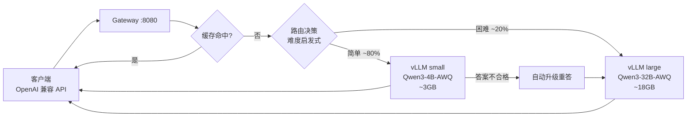

# Tandem — 一张卡上的大小模型智能路由网关

> 大厂验证过的 LLM 降本架构，压缩到一张 RTX 4090 和一条安装命令。

**Tandem**（双人自行车）：一大一小两个开源模型共骑一张消费级显卡。小模型（Qwen3-4B）当"前台"，处理约八成的高频简单请求；大模型（Qwen3-32B-AWQ）当"专家"，只接真正难的活。中间的网关是"分诊台"——每个请求进来先判难度，再决定给谁，答砸了自动升级重答。

这套「小模型打前站 + 智能路由 + 缓存 + 评测守门」的组合，Uber 用它把每千次请求成本降了 34%，OpenAI 把 router 直接内置进了 GPT-5；区别只是他们靠几百人的平台团队实现，Tandem 把同样的设计压缩到单卡自托管。

## 架构



单张 24GB 卡的显存预算：32B-AWQ 权重约 18GB + 4B-AWQ 约 3GB，剩余留给 KV cache。两个 vLLM 实例通过 `--gpu-memory-utilization` 分片共存。

## 特性

- **OpenAI 兼容**：`POST /v1/chat/completions`，`model` 填 `auto` 交给路由，填 `small`/`large` 手动指定。存量代码只改 base_url。
- **可解释的路由**：每个决策带信号明细（代码块、数学、推理关键词、上下文长度、工具调用……），响应头 `x-tandem-lane` / `x-tandem-reason` 直接可审计。
- **答案质量兜底**：小模型输出为空、JSON 无效、自报不确定时，自动在大模型上重答（非流式请求）。路由判错的代价从"用户拿到烂答案"降级为"多等几秒"。
- **精确缓存**：近确定性请求（低 temperature）按内容哈希缓存，批量任务的重复模板直接命中。
- **省钱看得见**：`GET /admin/stats` 报告各车道请求量、token 数、缓存命中、升级次数，以及"这些流量如果走云端 API 要花多少钱"。
- **评测守门**：路由策略有带标注的评测集（`evals/`），CI 上每次提交跑，准确率低于 90% 直接拦下——改启发式不会悄悄改坏路由。
- **首启自动调参**：`autotune` 探测 GPU 型号和显存，从硬件档位（24GB / 16GB / 12GB / 48GB）里选择能装下的最大模型组合。

## 快速开始

要求：NVIDIA GPU（12GB+ 显存）、驱动、Docker + NVIDIA Container Toolkit。

```bash
git clone https://github.com/murphyren225/local_infer.git
cd local_infer
./install.sh
```

首次启动会下载模型权重（24GB 档约 21GB）。然后：

```bash
curl http://localhost:8080/v1/chat/completions \
  -H 'Content-Type: application/json' \
  -d '{"model":"auto","messages":[{"role":"user","content":"把这句话翻译成英文：今天天气不错"}]}' -i
```

看响应头里的 `x-tandem-lane: small` —— 这条走了小模型，成本几乎为零。

无 GPU 也能开发：路由器、缓存、升级逻辑是纯 Python，单元测试和评测本地直接跑：

```bash
PYTHONPATH=gateway python3 -m pytest gateway/tests -q
python3 evals/run_evals.py --verbose
```

## 配置

`config/tandem.example.yaml` 是全量注释版。最常改的两项：

- `routing.extra_large_keywords` / `extra_small_keywords`：把你业务里的"难活/简单活"词汇加进去；
- `lanes.*.revision`：上生产前把模型版本锁成具体 commit hash，上游悄悄换权重不该影响你的环境。

## 项目状态（诚实版）

| 部分 | 状态 |
|---|---|
| 路由 / 缓存 / 升级逻辑 | ✅ 21 个单元测试 + 28 条路由评测全过（CI 强制） |
| 网关服务（FastAPI，含流式透传） | ✅ 代码完成，可对接任意 OpenAI 兼容后端 |
| 4090 上的端到端验证（双 vLLM 共卡） | ⚠️ 尚未在真机上跑通，显存分片参数待实测校准 |
| Tier-2 路由（小模型难度预判） | 📋 规划中，见 [docs/roadmap.md](docs/roadmap.md) |

## 文档

- [docs/architecture.md](docs/architecture.md) — 完整系统设计：分层、请求生命周期、显存预算、取舍
- [docs/routing.md](docs/routing.md) — 三层路由策略与调参方法
- [docs/roadmap.md](docs/roadmap.md) — v0.1 → v0.4 路线图

## License

MIT
