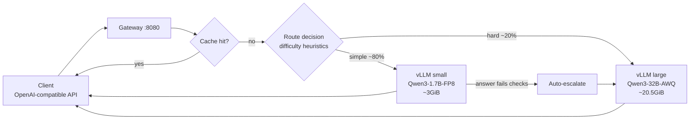

# Tandem — a smart routing gateway for a large + small LLM pair on one GPU

**English** | [中文](README.zh-CN.md)

> The LLM cost-cutting architecture validated at big tech companies, compressed onto a single RTX 4090 and one install command.

**Tandem** (as in a tandem bicycle): one large and one small open-source model share a single consumer GPU. The small model works the "front desk," handling the ~80% of traffic that is high-frequency, simple work; the large model (Qwen3-32B-AWQ) is the "expert" that only takes the genuinely hard jobs. The gateway in between is the triage desk — every request gets a difficulty assessment before it is dispatched, and a botched answer is automatically retried on the large model.

This combination — small model up front + smart routing + caching + eval gating — is how Uber cut cost per thousand requests by 34%, and OpenAI built a router directly into GPT-5. The only difference is that they implement it with platform teams of hundreds; Tandem compresses the same design into single-card self-hosting.

## Architecture



The two vLLM instances co-reside on one 24GB card via `--gpu-memory-utilization` slicing (97.4% measured utilization), made possible by three levers: FP8 KV cache, `--enforce-eager`, and capped batch limits. Full memory accounting in [docs/architecture.md](docs/architecture.md) (Chinese).

## Measured performance (RTX 4090D, both models co-resident)

| Lane | Model | Context | TTFT | Throughput |
|---|---|---|---|---|
| small | Qwen3-1.7B-FP8 | 4096 | 0.15 s | 108 tok/s (4 concurrent, aggregate) |
| large | Qwen3-32B-AWQ | 6144 | 0.17 s | 38 tok/s (2 concurrent, aggregate) |

One hard-won empirical finding: **32B-AWQ + 4B-AWQ does not fit in 24GB** — the 4B model's fp16 vocabulary head and the dual-process runtime overhead add ~1.4GiB over the paper estimate. So the 24GB tier uses 1.7B-FP8 as the front desk; a 4B front desk needs 32GB+ VRAM (see `config/profiles/`).

## Features

- **OpenAI-compatible**: `POST /v1/chat/completions`; set `model` to `auto` for routed dispatch, or `small`/`large` to pick a lane explicitly. Existing code only changes its base_url.
- **Explainable routing**: every decision carries its signal breakdown (code blocks, math, reasoning keywords, context length, tool use, …), exposed via `x-tandem-lane` / `x-tandem-reason` response headers for auditing.
- **Answer-quality backstop**: when the small model returns empty output, invalid JSON, or self-reported uncertainty, the request is silently retried on the large model (non-streaming). A routing mistake degrades from "user gets a bad answer" to "user waits a few extra seconds."
- **Exact-match caching**: near-deterministic requests (low temperature) are cached by content hash; repeated templates in batch jobs hit directly.
- **Savings you can see**: `GET /admin/stats` reports per-lane request counts, token totals, cache hits, escalations, and "what this traffic would have cost on a cloud API."
- **Eval gating**: the routing policy ships with a labeled eval set (`evals/`) that CI runs on every push — accuracy below 90% fails the build, so heuristic changes can't silently break routing.
- **First-boot autotune**: `autotune` probes GPU model and VRAM, then picks the largest model combination that fits from the hardware tiers (12 / 16 / 24 / 48 GB).

## Quick start

Requirements: NVIDIA GPU (12GB+ VRAM), driver, Docker + NVIDIA Container Toolkit.

```bash
git clone https://github.com/murphyren225/local_infer.git
cd local_infer
./install.sh
```

The first boot downloads model weights (~21GB for the 24GB tier). Then:

```bash
curl http://localhost:8080/v1/chat/completions \
  -H 'Content-Type: application/json' \
  -d '{"model":"auto","messages":[{"role":"user","content":"Translate to English: 今天天气不错"}]}' -i
```

Check the `x-tandem-lane: small` response header — this one ran on the small model at near-zero cost.

No Docker available (e.g. a rented GPU container)? Use the bare-process path, validated end-to-end on a real machine:

```bash
pip install vllm && ./scripts/run_bare.sh
```

Development needs no GPU at all: the router, cache, and escalation logic are pure Python:

```bash
PYTHONPATH=gateway python3 -m pytest gateway/tests -q
python3 evals/run_evals.py --verbose
```

## Configuration

`config/tandem.example.yaml` is the fully-commented reference. The two knobs you'll touch first:

- `routing.extra_large_keywords` / `extra_small_keywords`: add your domain's "hard task" / "easy task" vocabulary;
- `lanes.*.revision`: pin model versions to a specific commit hash before production — an upstream weight swap should never silently change your deployment.

## Project status (the honest version)

| Component | Status |
|---|---|
| Routing / cache / escalation logic | ✅ 21 unit tests + 28-case routing eval, all passing (CI-enforced) |
| Gateway service (FastAPI, incl. streaming passthrough) | ✅ Complete; works against any OpenAI-compatible backend |
| 24GB real-machine end-to-end (dual vLLM on one card) | ✅ Validated 2026-09-04 on an RTX 4090D: routing/cache/streaming/stats all pass; memory parameters calibrated from measurement |
| Docker Compose path | ⚠️ Parameters match the bare-process path, but Compose itself is unvalidated (test machine had no Docker) |
| Other VRAM tiers (12/16/48GB) | ⚠️ Estimated from measured overhead, not yet validated |
| Tier-2 routing (small-model difficulty pre-judging) | 📋 Planned, see [docs/roadmap.md](docs/roadmap.md) |

## Documentation

Design docs are currently in Chinese:

- [docs/architecture.md](docs/architecture.md) — full system design: layers, request lifecycle, memory budget, trade-offs
- [docs/routing.md](docs/routing.md) — the three-tier routing policy and how to tune it
- [docs/agent-interface.md](docs/agent-interface.md) — agent protocol v1: `x-tandem-hint` step-level routing, `x-tandem-session` per-task ledgers, and the orchestrator blueprint (implemented gateway-side)
- [docs/roadmap.md](docs/roadmap.md) — roadmap v0.1 → v0.4

## License

MIT
