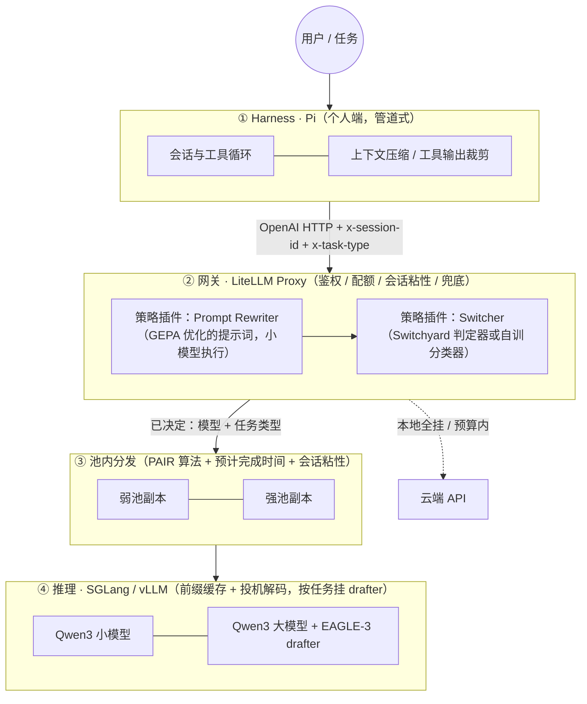

# Agent 推理栈技术框架（草案）

> 状态：讨论稿，2026-09-22。四个模块：调度（Switcher + 组网）、推理、投机解码、Harness。
> 设计原则只有一条：**以省 token 为第一目标，速度第二，两者都用同一套指标衡量。**

## 0. 一张图



层与层之间只有 OpenAI 格式的 HTTP，外加两个请求头：`x-session-id`（会话，供粘性和前缀缓存）、`x-task-type`（任务类型，供路由和 drafter 选择）。任何一层可以单独替换。

## 1. 模块一：Switcher + 组网

### 1.1 Switchyard 里的"根模型"是什么

Switchyard 没有自己的模型。它的决策核心是**判定器（judge / classifier）**：一次普通的 chat 调用，用一段打包好的提示词让任意模型输出结构化裁决 `{p_solve, capability_boundary, crux, primary_rule}`，然后按阈值决定走弱模型还是强模型。判定器是配置项 `classifier_target`，可以是云端 gpt-4o-mini，也可以是本地 1.7B（我们现在就这么用）。提示词可以用 `prompt` 字段整段替换，裁决字段固定。

它**不做 prompt 改写**，也不做任何请求变换；只回答"这条请求给哪个模型"。

### 1.2 插件形态：谁做外壳，谁做策略

| 方案 | 外壳 | 策略 | 评价 |
|---|---|---|---|
| A | Switchyard 独立代理 | Switchyard 内置算法 | 现状。没有鉴权、配额、预算、会话粘性；无法插入改写步骤 |
| B | **LiteLLM Proxy** | Switchyard 作为 LiteLLM 插件（官方支持） | 得到企业功能，策略仍是 Switchyard 的 |
| C | **LiteLLM Proxy** | 自写 `CustomRoutingStrategy`：先改写，再判定 | 改写和路由在一个插件里，策略完全自主 |

推荐 **C，判定部分先复用 Switchyard 的嵌入式库（libsy）**，等有了自己的评测集再换成自训分类器。LiteLLM 提供的、我们不用再造的：虚拟 key、按人/队限额、云端预算、会话粘性（"pin every request of a conversation to the deployment that served its first request"）、重试与冷却、上下文窗口预检、用量记录。

插件的输入输出：

```
输入  messages, x-task-type(可空), x-session-id
步骤  1. 任务分类（规则 + 小模型），补全 x-task-type
      2. Prompt Rewriter：按任务类型选一条 GEPA 优化过的改写提示词，
         用弱池小模型把用户输入改写成更短、更结构化的版本（可跳过）
      3. Switcher：判定 p_solve → 弱 / 强 / 云
输出  目标模型名 + 改写后的 messages + 头部透传给池内分发
```

### 1.3 RL 还是 GEPA

原设想"训一个 RL 模型决定改写和路由"，改为 **GEPA**（Genetic-Pareto，`pip install gepa`，DSPy 内置 `dspy.GEPA`）：

- GEPA 优化的对象是**文本**——改写提示词、判定提示词、任务分类规则——不是模型权重。它让一个反思模型读完整执行轨迹（错误、日志、token 用量）解释失败原因，再变异候选，按 Pareto 前沿保留。
- 需要的东西：任务集（几十到几百条真实 harness 任务）、指标（任务成功 × token 消耗）、一个反思用的强模型（可以是云端）、一个执行用的模型（本地）。100–500 次评测收敛，论文数据比 GRPO 少 35 倍评测量。
- 产物是几段提示词，直接进插件配置，不需要训练基础设施。

所以"RL 模型"这个组件在架构里不存在；存在的是**一个离线优化循环**，定期用新轨迹重跑 GEPA，更新改写词和判定词。指标里把 token 消耗放进目标函数，就是"以省 token 为原则"的直接体现。

（如果指的是 JEPA——LeCun 的联合嵌入预测架构——那是感知/表征学习方法，和路由与改写无关，不适用。）

### 1.4 PAIR 的位置：只做组网参考

PAIR 的可用部分是同模型多副本的分发算法（排队数 + GPU 压力 + 本地预留 + 有序故障转移）和 mDNS + PIN 的组网。它只认 Ollama / LM Studio、不认异构、不做会话粘性，所以不作为组件接入，而是把算法搬进我们的池内分发层，并加两条：

1. 按**预计完成时间**选副本（等待 + 本条耗时，速度自动实测），不按个数轮流。
2. **会话粘性优先**：同一 `x-session-id` 回同一副本，除非差距超过阈值——这是前缀缓存生效的前提，对 agent 流量比均衡更重要。

组网：同网段直连、跨网段填 IP、跨网络用 Tailscale/WireGuard 或节点主动到 Hub 的反向隧道（rathole/chisel）。节点只需连到 Hub，不需两两互通。

## 2. 模块二：推理

| 引擎 | 用在哪 | 理由 |
|---|---|---|
| **SGLang** | GPU 池默认 | RadixAttention 前缀缓存对多轮 agent 流量命中率高；投机解码实现最全（EAGLE-3 在 8B 上 +136%，MTP、STANDALONE、NGRAM 都有） |
| **vLLM** | GPU 池备选 | 生态最广、量化格式最全、工具调用解析器成熟；我们 24GB 档参数已校准 |
| llama.cpp | Mac / CPU 弱池 | 无 GPU 时唯一选择 |
| 云端 API | 兜底与超预算外的强任务 | 经 LiteLLM 计预算 |

两者都说 OpenAI 协议，上层不感知；按硬件和任务选，不全局固定（沿用 design.md 的原则）。切换成本是 preset 文件。

省 token 在这一层的落点：`enable_thinking` 按任务类型开关（小任务关思考，省 30–60% 输出 token）、`max_tokens` 按任务类型给上限、前缀缓存让重复输入不重复计算（不省计费 token 但省时间）。

## 3. 模块三：投机解码与 drafter

### 3.1 drafter 是什么

大模型逐 token 生成，每个 token 都要把整个模型的权重从显存读一遍，GPU 大部分时间在等数据。投机解码把"猜"和"验"分开：

- **drafter（起草者）**：一个很便宜的东西，一次猜出后面 k 个 token（比如 5 个）。
- **target（目标模型）**：把这 k 个候选一次性并行验证——一次前向传播同时给出每个位置的正确答案；从左到右接受猜对的，第一个猜错处截断、用自己的答案替换。

因为验证是一次前向而不是 k 次，只要 drafter 常猜对，输出就快好几倍；**结果和不用投机完全一致**（无损），差的只是速度。关键指标是**接受长度**（平均每次验证接受几个 token）。

drafter 的几种实现：

| 类型 | 是什么 | 适合 |
|---|---|---|
| n-gram / prompt lookup | 从上下文里找重复片段直接当草稿，零模型 | 输出大量复述输入的任务：改写、编辑代码、抽取、JSON 回填 |
| 独立小模型（STANDALONE） | 同家族的小模型（1.7B 给 32B 起草） | 通用；我们弱池本来就有小模型 |
| **EAGLE-3 头** | 挂在目标模型上的一个小头，用目标模型的中间特征起草，树状验证 | 最快（论文 13B 上 5.6×），需要为每个目标模型训一次 |
| MTP | 模型自带的多 token 预测头 | 只有部分模型有（DeepSeek 系） |

### 3.2 "领域专用 drafter"的含义

接受长度取决于 drafter 对目标模型在**这类文本上**的分布猜得准不准。通用 drafter 在代码、SQL、JSON 工具调用、某个业务的固定话术上表现差异很大。领域专用 = 用该领域的轨迹训练（或选择）drafter：

- EAGLE-3 头用**我们自己 harness 的真实轨迹**训练（代码补丁、工具调用 JSON、报表文本各一份），8×3090 一两天一个，成本可控；数据就是网关日志，天然匹配。
- n-gram 对"编辑类"任务几乎免费且极准，按任务类型直接启用。
- 多个 drafter 的选择在**请求级别**由 `x-task-type` 决定：SGLang/vLLM 目前一个实例只挂一个 drafter，所以做法是同一目标模型起多个实例各挂不同 drafter，池内分发按任务类型选实例；或先只用一个"混合领域"头，等数据证明分开有收益再拆。

衡量：每种任务类型下的接受长度、tok/s、端到端延迟，和无投机基线对比；质量不用测（无损）。

## 4. 模块四：Harness（Pi）作为管道

Pi 保持不改，作为管道的"执行端"：会话循环、工具执行、扩展。省 token 的手段按收益排序：

| 手段 | 做法 | 预期 |
|---|---|---|
| **稳定前缀 + 会话粘性** | 系统提示、工具定义放最前且不变；网关按会话固定副本 → 服务端前缀缓存命中 | 不省计费 token，省 50%+ 预填充时间；云端走 prompt caching 省 80–90% 输入费用 |
| **工具输出裁剪** | 扩展层对 `bash`/`read` 输出截断、去重、只留错误行；大文件按行范围读 | agent 任务中工具输出常占输入 token 一半以上 |
| **压缩阈值** | Pi `compaction.reserveTokens` / `keepRecentTokens` 按模型窗口调（我们已把 16384 调到 1024） | 避免每轮都触发压缩或从不压缩 |
| **子任务隔离** | 探索类工作交给子会话，只把结论带回主会话 | 主会话上下文不被文件内容撑爆 |
| **按任务关思考、限长度** | 网关按 `x-task-type` 设 `enable_thinking` 与 `max_tokens` | 小任务输出 token 减半以上 |
| **Prompt Rewriter** | 网关插件把冗长输入改写成结构化短输入（GEPA 优化） | 输入 token 减 20–40%，同时提高小模型成功率（少升级到大模型） |
| **小模型先答** | Switcher 弱先强后 | 大模型调用次数是成本大头 |

harness 侧只需两件事：每次请求带 `x-session-id`（个人端本机服务已实现）和 `x-task-type`（新增，由 Pi 扩展按工具/意图打标，缺省由网关分类）。

## 5. 各模块怎么连

```
Pi ──HTTP──▶ 本机服务(补 session id) ──HTTP──▶ LiteLLM Proxy
   LiteLLM: 鉴权/配额 → 策略插件[分类 → 改写 → Switcher] → 选目标模型
   ──HTTP──▶ 池内分发(按预计完成时间 + 粘性 + 任务类型选实例)
   ──HTTP──▶ SGLang/vLLM 实例(前缀缓存 + 对应 drafter) ──▶ 原路返回
   任一环失败 → LiteLLM fallback → 云端(预算内)
离线循环: 网关日志(轨迹 + token 数 + 成功与否) → GEPA → 新的改写词/判定词
                                             └→ EAGLE-3 训练数据 → 新 drafter
```

全部接口是 OpenAI HTTP，两个自定义头透传。没有共享内存、没有进程内调用跨层。

## 6. 省 token 的总原则

按"每个任务消耗的 token"这一个指标优化，收益从大到小：

1. 少调大模型（Switcher）
2. 少输出（关思考、限长度、结构化输出）
3. 少输入（工具输出裁剪、改写、子任务隔离）
4. 重复输入不重复算（前缀缓存 + 粘性；云端 prompt caching）
5. 同样的 token 更快出（投机解码）——不省 token，省时间和 GPU 秒

第 5 条放最后是因为它不减少 token，只降低单位成本；前四条直接减少量。

## 7. 分阶段

| 阶段 | 做什么 | 验收 |
|---|---|---|
| 1 | 指标口径 + 重放机：录 100 条真实 harness 轨迹，记每任务 token/延迟/成功 | 一张基线表 |
| 2 | LiteLLM 外壳 + 粘性 + 池内分发（预计完成时间） | 同一轨迹重放，p95 和 token 对比基线 |
| 3 | 策略插件：分类 + Switcher（libsy） | 大模型调用次数下降，成功率不降 |
| 4 | GEPA 离线循环：优化改写词和判定词 | token/任务再降 |
| 5 | SGLang + EAGLE-3（先通用头，再用自有轨迹训领域头） | tok/s 与接受长度 |
| 6 | 跨网络组网（Tailscale / 反向隧道） | 异地节点入队 |

## 8. 待定问题

- 任务分类的粒度（代码 / 编辑 / 问答 / 抽取 / 工具循环？）决定 drafter 和改写词的数量，先从 4–5 类开始。
- 改写是否会改变用户意图：GEPA 目标函数里要有"改写前后成功率不降"的约束项。
- 多 drafter 多实例会分散显存，24GB 档可能只够一个；先在 48GB 档验证。
- 云端 prompt caching 的前缀稳定性要求和本地前缀缓存一致，harness 侧一套做法两边受益。
