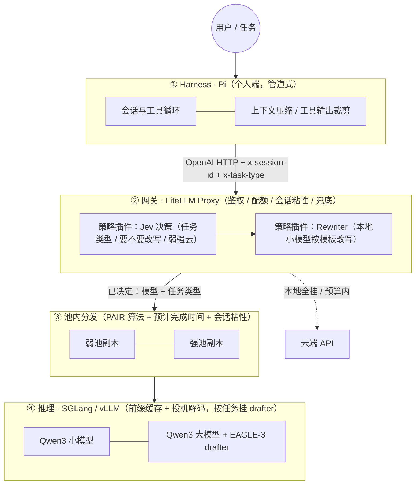

# Agent 推理栈技术框架（草案）

> 状态：讨论稿，2026-09-22。四个模块：调度（Switcher + 组网）、推理、投机解码、Harness。
> 设计原则只有一条：**以省 token 为第一目标，速度第二，两者都用同一套指标衡量。**

## 0. 一张图



层与层之间只有 OpenAI 格式的 HTTP，外加两个请求头：`x-session-id`（会话，供粘性和前缀缓存）、`x-task-type`（任务类型，供路由和 drafter 选择）。任何一层可以单独替换。

## 1. 模块一：Switcher + 组网

### 1.1 Switchyard 里的"根模型"是什么

Switchyard 没有自己的模型。它的决策核心是**判定器（judge / classifier）**：一次普通的 chat 调用，用一段打包好的提示词让任意模型输出结构化裁决 `{p_solve, capability_boundary, crux, primary_rule}`，然后按阈值决定走弱模型还是强模型。判定器是配置项 `classifier_target`，可以是云端 gpt-4o-mini，也可以是本地 1.7B（我们现在就这么用）。提示词可以用 `prompt` 字段整段替换，裁决字段固定。

它**不做 prompt 改写**，也不做任何请求变换；只回答"这条请求给哪个模型"。

### 1.2 插件形态：谁做外壳，谁做策略

| 方案 | 外壳 | 策略 | 评价 |
|---|---|---|---|
| A | Switchyard 独立代理 | Switchyard 内置算法 | 现状。没有鉴权、配额、预算、会话粘性；无法插入改写步骤 |
| B | **LiteLLM Proxy** | Switchyard 作为 LiteLLM 插件（官方支持） | 得到企业功能，策略仍是 Switchyard 的 |
| C | **LiteLLM Proxy** | 自写 `CustomRoutingStrategy`：先改写，再判定 | 改写和路由在一个插件里，策略完全自主 |

推荐 **C，判定环节用 Jev（§1.3），无 key 时退回 Switchyard 的嵌入式库（libsy）做本地判定**。LiteLLM 提供的、我们不用再造的：虚拟 key、按人/队限额、云端预算、会话粘性（"pin every request of a conversation to the deployment that served its first request"）、重试与冷却、上下文窗口预检、用量记录。

插件的输入输出：

```
输入  messages, x-task-type(可空), x-session-id
步骤  1. 问 Jev（一次调用，多个问题并行）：任务类型？需要改写吗？弱 / 强 / 云？
         预计输出长度档位？ → 补全 x-task-type
      2. Prompt Rewriter：Jev 说要改时，用弱池小模型按该任务类型的模板改写（可跳过）
      3. 按 Jev 的选择定目标模型；置信度低于阈值时按保守规则（走强）
输出  目标模型名 + 改写后的 messages + 头部透传给池内分发
```

### 1.3 决策模型：两种形式，同一个接口

选模型这一步（也包括"要不要改写"）做成一个可替换的**决策器**，接口固定：

```
输入  状态：最近几条消息的摘要（角色 + 截断文本）、是否带工具/图片、会话已升级否、x-task-type(可空)
输出  {task_type, rewrite: 0-1, route: {weak: p, strong: p, cloud: p}, out_len_bucket, confidence}
```

两种实现，配置切换，可以同时运行做对照（一个决策、一个影子记录）。

#### 形式一：Jev（TypeSafe System One，外部 API）

不是生成式 LLM。输入"状态"加一个或多个**带类型的问题**，输出概率而不是文字：

| 类型 | 返回 | 在我们这里问什么 |
|---|---|---|
| Choice | 各选项的概率 + 置信度 | 走 弱 / 强 / 云？任务类型是 代码 / 编辑 / 问答 / 抽取 / 工具循环？ |
| Noul（是/否） | 0–1 | 需要先改写吗？小模型能独立完成吗？这个工具调用有风险吗？ |
| Score | 描述范围内的分值 | 预计输出长度档位（决定 `max_tokens`）；难度分 |

多个问题并行问，延迟几乎不随问题数增长。公开数据：路由/分类任务中位延迟 0.19–0.67 秒，
$0.042 / 百万输入 token（只收输入），一次判断约 $0.00003；工单分诊 98.3% 准确，
Switchyard 式四档难度 40 条全对（中档置信度 0.57–0.67）。

现成参考：`prismhq/jev-router`（MIT）——LiteLLM Proxy 的 pre-call hook 里做最小化摘要、
按能力过滤候选、问 Jev；无 key 时退化为"最便宜的合格模型"。

限制：**只有云 API、无开源权重**，请求摘要要发到 TypeSafe（与"数据不出内网"冲突，
必须可关闭）；已知弱项是数字、日期、对抗性内容。

#### 形式二：自训 RL 路由器（本地，无数据出网）

一个小模型（0.5–1.7B 的 Qwen 加分类头，或直接用弱池模型加 LoRA）当策略，
输出同一个接口的概率。训练不是从零 RL，是**用网关日志做离线学习**：

| 要素 | 定义 |
|---|---|
| 状态 | 与 Jev 相同的请求摘要（文本编码） |
| 动作 | 路由 {弱, 强, 云} × 改写 {是, 否}，共 6 个离散动作 |
| 奖励 | `成功(0/1) − λ·token 消耗 − μ·延迟`，λ、μ 按业务定价；升级到强/云的成本自然进入 token 项 |
| 数据 | 网关日志：(摘要, 实际走的动作, 结果)。要有**探索**——按 ε 比例随机改走另一条路，否则日志里没有反事实，学不出来 |
| 算法 | 先上下文赌博机（contextual bandit，逻辑回归 / 小网络，IPS 或 doubly-robust 校正）；数据够了（几万条）再上 GRPO 风格的策略微调。多轮会话的"升级不回落"当作状态的一部分，不做长视野信用分配 |
| 冷启动 | 前几周用 Switchyard 判定器或 Jev 当行为策略产生数据，同时影子记录 RL 的选择做对照 |

推理成本：一次小模型前向，几十毫秒，本地。

#### 两种形式对比

| | Jev | 自训 RL |
|---|---|---|
| 上线时间 | 当天（有 key 即可） | 需要几周日志 + 训练循环 |
| 数据出网 | 是（最小化摘要） | 否 |
| 每次判断成本 / 延迟 | 约 $0.00003 / 0.2–0.7 s | 约 0 / 几十 ms（占本地一点算力） |
| 适应本客户任务分布 | 靠问题措辞和选项描述 | 靠日志自动适应，越用越准 |
| 可解释 | 置信度 + 选项概率 | 同样输出概率；奖励定义即业务定价，可审计 |
| 维护 | 无 | 训练管线、探索比例、奖励漂移 |
| 风险 | 供应商变更、隐私 | 探索期少量请求走了次优路线 |

**推荐路径**：先 Jev（或无 key 时的 Switchyard 判定器）上线并开始记日志，同时开 ε 探索；
日志够了训 RL 路由器，先影子对照、后接管；敏感客户只给 RL。两者接口相同，插件不用改。
改写文本仍由本地小模型按模板生成，决策器只回答"要不要改、改成哪类"。

### 1.3.1 自己做一个开源的 Jev

Jev 发布八天内开源界已经补齐了同类，做法分三档，越往下越贴我们的任务：

| 档 | 代表 | 怎么出概率 | 成本 | 数字 |
|---|---|---|---|---|
| 免训练 | **AnyJev**（Nokia，Apache-2.0）、open-alternative-jev | 拿任意开源 LLM 的下一 token logits 对选项打分；循环轮换选项顺序消除位置偏差；温度缩放校准 | 零训练，一次前向（K 个选项 K 次预填充） | Qwen3-32B 校准误差 ECE 0.036（Jev 0.144）；H100 上 0.25 s/决策 |
| 小模型微调 | **Laya**（421M，ModernBERT，Apache-2.0）、Kev-9B（Qwen3.5 微调） | 每个选项一个 [MASK] 位打分再 softmax | 蒸馏训练，CPU 可跑 | Laya CPU 0.2–0.5 s、GPU 33 ms；Kev-9B 准确率 0.852 vs Jev 0.857 |
| 自训 | 我们自己 | 用网关日志 + 强模型/Jev 标注，蒸馏到 Laya 尺寸的编码器，温度缩放校准 | 几千条标注、几小时训练 | 目标 ECE < 0.05 |

结论：**能做，而且第一档今天就能上**——AnyJev 直接套在弱池的 Qwen3 上，决策器接口不变，
数据不出网。路由场景看的是阈值上的概率而不是标签，所以选型指标是校准误差（ECE），不是准确率。
路线：AnyJev（当天）→ 用它和 Jev 的输出给日志打标 → 蒸馏成 Laya 尺寸自有模型（CPU 上几十毫秒）
→ 日志够了再训 §1.3 形式二的 RL 路由器。三步都是同一个接口。

### 1.5 Prompt Rewriter 怎么做

"改写"其实是四件不同的事，混在一起会互相抵消；分开各用各的工具：

| 层 | 目的 | 工具 | 什么时候做 |
|---|---|---|---|
| 意图整理 | 把口语、语音转写、零散要求整理成结构化短指令（Typeless 做的就是这一层，只是它面向打字场景、走云端 LLM） | 本地小模型 + 按任务类型的模板；由决策器判"要不要改" | **只在会话开头做一次**，之后不再动用户输入 |
| 文档压缩 | 用户贴进来的长文、检索片段 | **LLMLingua-2**（BERT 尺寸的 token 分类器，MIT，2–5× 压缩，本地） | 内容进入上下文之前 |
| 轨迹瘦身 | 删掉过期、重复、无用的工具输出 | AgentDiet 思路（论文：输入 token 减 40–60%，成本减 21–36%，任务成功率不变）；在 Pi 扩展层实现 | 每轮工具结果回填时 |
| 输出约束 | 限长度、关思考、结构化输出 | 网关按任务类型设参数 | 每次请求 |

两条硬规则来自"Token Reduction Is Not Cost Reduction"（2026）这篇的实测：token 减少和账单减少相关性只有 0.15；
最激进的工具输出压缩减了 38% token 却**多花了 6.8% 钱**，因为改动上下文打碎了前缀缓存，还降低了补丁成功率。所以：

1. **改写不能破坏前缀稳定性**：系统提示、工具定义、历史消息一旦发出就不再改写；只改"新进入"的部分。
2. **考核指标是每个成功任务的成本**（含缓存命中、轨迹长度、正确率），不是 token 数。

### 1.6 开源框架可复现性（2026-09-25 实测记录）

| 部件 | 框架 | 许可 | 训练代码/数据 | 本机复现 | 结论 |
|---|---|---|---|---|---|
| 决策器·免训练 | AnyJev（Nokia） | Apache-2.0 | 不需训练；L1/L2 校准脚本随仓库，附 BANKING77 等基准 | 需 GPU（4090 关机未跑） | 首选：套在弱池 Qwen3 上，Qwen3-8B ECE 0.095（L1），32B 0.036 |
| 决策器·免训练 | open-alternative-jev（`so1`） | Apache-2.0 | 同上，温度缩放 | 需 GPU | 与 AnyJev 二选一；27B 上 ECE 0.020 |
| 决策器·小模型 | **Laya**（Convai，421M ModernBERT） | Apache-2.0 | **完整**：Kaggle 笔记本 2×T4 4–5 小时，含建数据、RLCD 训练、温度校准 | **Intel Mac CPU 跑通**：`pip install laya`，8 条路由样例每条 5–7 s（官方 T4 33 ms、CPU 0.2–0.5 s，我们 torch 2.2 老 CPU 更慢） | 基础权重零样本几乎随机（把数学证明、PR 评审都判成 small；官方也承认 base 0.36 ≈ 随机 0.32），**必须用自己的日志微调**；微调后官方 0.77 |
| 决策器·中模型 | Kev（Jared Palmer，Qwen3.5 0.8B–27B） | Apache-2.0 | 完整：JSONL 数据格式、LoRA r=16、H100 1–2 小时；服务端兼容 TypeSafe SDK | 4B 需 32GB，未跑 | 想要"直接替换 Jev"时选它；9B 准确率 0.852 vs Jev 0.857 |
| 决策器·中模型 | Decider（Mapika，Qwen3.5 2B/4B/35B-A3B） | Apache-2.0 | 95 个公开数据集 SFT，独立复现 | 未跑 | 校准偏差（ECE 0.15–0.31），不如上面两个 |
| 改写·压缩 | **LLMLingua-2**（Microsoft） | MIT | 模型公开，训练用 GPT-4 蒸馏（数据在论文） | **Mac CPU 跑通**：`pip install llmlingua`，728→394 token（rate 0.33），约 1 s | 对会议纪要类文本好；**对代码/日志会破坏结构**（下划线被拆、缩进丢），工具输出不要用它，只用于用户贴的长文档 |
| 改写·轨迹瘦身 | AgentDiet（FSE 2026，官方代码 `xywen97/Costdown`） | **未标许可** | 代码嵌在 trae_agent + SWE-bench 里，`traj_analyzer.py`；有 lingua/random/delete 对照模式 | 未跑（要 Docker + SWE-bench） | 思路可抄（删过期/重复/无用观察），代码不能直接用；在 Pi 扩展层自己实现规则版 |
| 改写·意图整理 | 无成熟开源框架 | — | Typeless 类产品闭源 | — | 本地小模型 + 任务模板即可，难点在评测不在模型 |

两条实测教训：
1. 决策器的开源路线是通的，但**零样本不能用**，价值全在"用自己的日志微调 + 校准"；Laya 的训练笔记本是目前最完整、成本最低的起点（免费 T4 半天）。
2. 通用压缩器不能碰工具输出。工具输出的瘦身用规则（去重块、丢警告、保留失败段）比模型安全，且不会破坏前缀缓存。

本机环境：`~/pair/oss-venv`（Python 3.10 + torch 2.2.2，Intel Mac 最后一个可用版本），测试脚本 `~/pair/test_laya.py`、`~/pair/test_lingua.py`。

### 1.4 PAIR 的位置：只做组网参考

PAIR 的可用部分是同模型多副本的分发算法（排队数 + GPU 压力 + 本地预留 + 有序故障转移）和 mDNS + PIN 的组网。它只认 Ollama / LM Studio、不认异构、不做会话粘性，所以不作为组件接入，而是把算法搬进我们的池内分发层，并加两条：

1. 按**预计完成时间**选副本（等待 + 本条耗时，速度自动实测），不按个数轮流。
2. **会话粘性优先**：同一 `x-session-id` 回同一副本，除非差距超过阈值——这是前缀缓存生效的前提，对 agent 流量比均衡更重要。

组网：同网段直连、跨网段填 IP、跨网络用 Tailscale/WireGuard 或节点主动到 Hub 的反向隧道（rathole/chisel）。节点只需连到 Hub，不需两两互通。

## 2. 模块二：推理

| 引擎 | 用在哪 | 理由 |
|---|---|---|
| **SGLang** | GPU 池默认 | RadixAttention 前缀缓存对多轮 agent 流量命中率高；投机解码实现最全（EAGLE-3 在 8B 上 +136%，MTP、STANDALONE、NGRAM 都有） |
| **vLLM** | GPU 池备选 | 生态最广、量化格式最全、工具调用解析器成熟；我们 24GB 档参数已校准 |
| llama.cpp | Mac / CPU 弱池 | 无 GPU 时唯一选择 |
| 云端 API | 兜底与超预算外的强任务 | 经 LiteLLM 计预算 |

两者都说 OpenAI 协议，上层不感知；按硬件和任务选，不全局固定（沿用 design.md 的原则）。切换成本是 preset 文件。

省 token 在这一层的落点：`enable_thinking` 按任务类型开关（小任务关思考，省 30–60% 输出 token）、`max_tokens` 按任务类型给上限、前缀缓存让重复输入不重复计算（不省计费 token 但省时间）。

## 3. 模块三：投机解码与 drafter

### 3.1 drafter 是什么

大模型逐 token 生成，每个 token 都要把整个模型的权重从显存读一遍，GPU 大部分时间在等数据。投机解码把"猜"和"验"分开：

- **drafter（起草者）**：一个很便宜的东西，一次猜出后面 k 个 token（比如 5 个）。
- **target（目标模型）**：把这 k 个候选一次性并行验证——一次前向传播同时给出每个位置的正确答案；从左到右接受猜对的，第一个猜错处截断、用自己的答案替换。

因为验证是一次前向而不是 k 次，只要 drafter 常猜对，输出就快好几倍；**结果和不用投机完全一致**（无损），差的只是速度。关键指标是**接受长度**（平均每次验证接受几个 token）。

drafter 的几种实现：

| 类型 | 是什么 | 适合 |
|---|---|---|
| n-gram / prompt lookup | 从上下文里找重复片段直接当草稿，零模型 | 输出大量复述输入的任务：改写、编辑代码、抽取、JSON 回填 |
| 独立小模型（STANDALONE） | 同家族的小模型（1.7B 给 32B 起草） | 通用；我们弱池本来就有小模型 |
| **EAGLE-3 头** | 挂在目标模型上的一个小头，用目标模型的中间特征起草，树状验证 | 最快（论文 13B 上 5.6×），需要为每个目标模型训一次 |
| MTP | 模型自带的多 token 预测头 | 只有部分模型有（DeepSeek 系） |

### 3.2 "领域专用 drafter"的含义

接受长度取决于 drafter 对目标模型在**这类文本上**的分布猜得准不准。通用 drafter 在代码、SQL、JSON 工具调用、某个业务的固定话术上表现差异很大。领域专用 = 用该领域的轨迹训练（或选择）drafter：

- EAGLE-3 头用**我们自己 harness 的真实轨迹**训练（代码补丁、工具调用 JSON、报表文本各一份），8×3090 一两天一个，成本可控；数据就是网关日志，天然匹配。
- n-gram 对"编辑类"任务几乎免费且极准，按任务类型直接启用。
- 多个 drafter 的选择在**请求级别**由 `x-task-type` 决定：SGLang/vLLM 目前一个实例只挂一个 drafter，所以做法是同一目标模型起多个实例各挂不同 drafter，池内分发按任务类型选实例；或先只用一个"混合领域"头，等数据证明分开有收益再拆。

衡量：每种任务类型下的接受长度、tok/s、端到端延迟，和无投机基线对比；质量不用测（无损）。

## 4. 模块四：Harness（Pi）作为管道

Pi 保持不改，作为管道的"执行端"：会话循环、工具执行、扩展。省 token 的手段按收益排序：

| 手段 | 做法 | 预期 |
|---|---|---|
| **稳定前缀 + 会话粘性** | 系统提示、工具定义放最前且不变；网关按会话固定副本 → 服务端前缀缓存命中 | 不省计费 token，省 50%+ 预填充时间；云端走 prompt caching 省 80–90% 输入费用 |
| **工具输出裁剪** | 扩展层对 `bash`/`read` 输出截断、去重、只留错误行；大文件按行范围读 | agent 任务中工具输出常占输入 token 一半以上 |
| **压缩阈值** | Pi `compaction.reserveTokens` / `keepRecentTokens` 按模型窗口调（我们已把 16384 调到 1024） | 避免每轮都触发压缩或从不压缩 |
| **子任务隔离** | 探索类工作交给子会话，只把结论带回主会话 | 主会话上下文不被文件内容撑爆 |
| **按任务关思考、限长度** | 网关按 `x-task-type` 设 `enable_thinking` 与 `max_tokens` | 小任务输出 token 减半以上 |
| **Prompt Rewriter** | Jev 判断要不要改、改成哪类；本地小模型按模板改写 | 输入 token 减 20–40%，同时提高小模型成功率（少升级到大模型） |
| **小模型先答** | Switcher 弱先强后 | 大模型调用次数是成本大头 |

harness 侧只需两件事：每次请求带 `x-session-id`（个人端本机服务已实现）和 `x-task-type`（新增，由 Pi 扩展按工具/意图打标，缺省由网关分类）。

## 5. 各模块怎么连

```
Pi ──HTTP──▶ 本机服务(补 session id) ──HTTP──▶ LiteLLM Proxy
   LiteLLM: 鉴权/配额 → pre-call hook[Jev: 类型/改写?/弱强云 → 本地改写] → 选目标模型
   ──HTTP──▶ 池内分发(按预计完成时间 + 粘性 + 任务类型选实例)
   ──HTTP──▶ SGLang/vLLM 实例(前缀缓存 + 对应 drafter) ──▶ 原路返回
   任一环失败 → LiteLLM fallback → 云端(预算内)
离线循环: 网关日志(轨迹 + token 数 + 成功与否) → 改写模板迭代 / Jev 问题措辞校准
                                             └→ EAGLE-3 训练数据 → 新 drafter
```

全部接口是 OpenAI HTTP，两个自定义头透传。没有共享内存、没有进程内调用跨层。

## 6. 省 token 的总原则

按"每个任务消耗的 token"这一个指标优化，收益从大到小：

1. 少调大模型（Switcher）
2. 少输出（关思考、限长度、结构化输出）
3. 少输入（工具输出裁剪、改写、子任务隔离）
4. 重复输入不重复算（前缀缓存 + 粘性；云端 prompt caching）
5. 同样的 token 更快出（投机解码）——不省 token，省时间和 GPU 秒

第 5 条放最后是因为它不减少 token，只降低单位成本；前四条直接减少量。

## 7. 分阶段

| 阶段 | 做什么 | 验收 |
|---|---|---|
| 1 | 指标口径 + 重放机：录 100 条真实 harness 轨迹，记每任务 token/延迟/成功 | 一张基线表 |
| 2 | LiteLLM 外壳 + 粘性 + 池内分发（预计完成时间） | 同一轨迹重放，p95 和 token 对比基线 |
| 3 | 策略插件：决策器接口 + Jev 实现（参考 jev-router）+ ε 探索与日志 | 大模型调用次数下降，成功率不降，路由判断 <1s |
| 3b | 自训 RL 路由器：赌博机版 → 影子对照 → 接管 | 与 Jev 同分布下成功率持平、token 更低 |
| 4 | Rewriter 模板 + 离线优化循环（GEPA 可选） | token/任务再降 |
| 5 | SGLang + EAGLE-3（先通用头，再用自有轨迹训领域头） | tok/s 与接受长度 |
| 6 | 跨网络组网（Tailscale / 反向隧道） | 异地节点入队 |

## 8. 待定问题

- 任务分类的粒度（代码 / 编辑 / 问答 / 抽取 / 工具循环？）决定 drafter 和改写词的数量，先从 4–5 类开始。
- 改写是否会改变用户意图：评测里要有"改写前后成功率不降"的约束项。
- Jev 是云 API：哪些客户可以开、摘要里允许带什么，要有明确策略；本地决策器（判定器或 RL）必须始终可用。
- RL 的探索比例 ε 和奖励里的 λ、μ 怎么定：先按 token 单价和 SLA 折算，上线后按每任务成本回看。
- 多 drafter 多实例会分散显存，24GB 档可能只够一个；先在 48GB 档验证。
- 云端 prompt caching 的前缀稳定性要求和本地前缀缓存一致，harness 侧一套做法两边受益。
