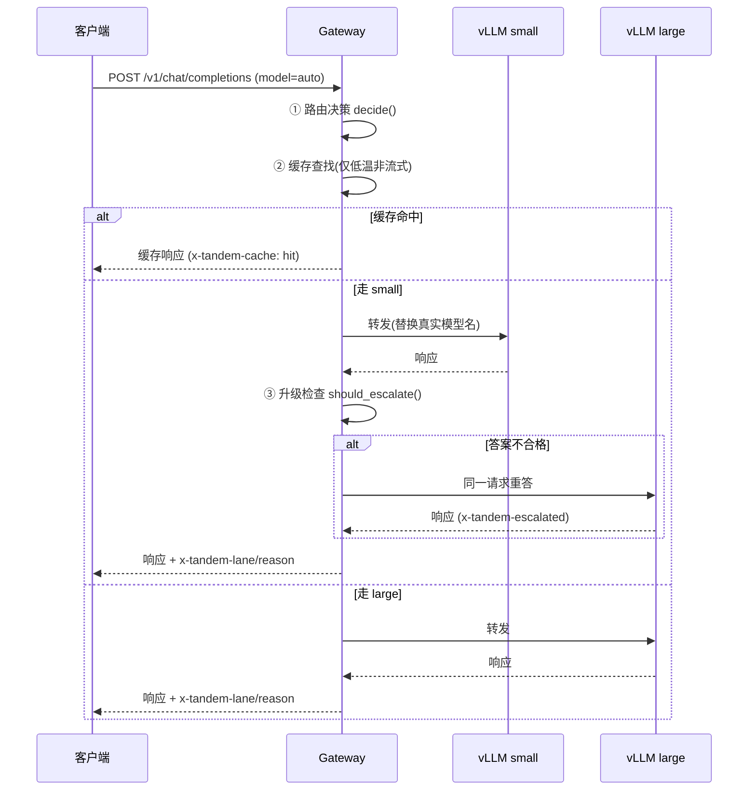

# Tandem 系统设计

## 1. 问题与目标

企业级 LLM 流量有一个被反复验证的分布：**约八成请求是高频简单任务**（翻译、总结、分类、提取、格式化），两成才需要深度推理。全部交给大模型（或云端 API）意味着为八成的"问路"支付"总监"的价格。

大厂的答案是统一网关 + 智能路由 + 缓存 + 持续评测（Uber 以此降本 34%；OpenAI 把 router 内置进 GPT-5；各推理厂商拼的就是量化后开源模型的性价比）。但这套架构此前只存在于有平台团队的公司内部。

**Tandem 的目标**：把这四层压缩到一张消费级 GPU 上，一条命令装完，中小团队买得起、维护得动。

非目标（v0.x 不做）：多卡/多机调度、多租户计费、模型微调、非 chat 接口（embeddings、图像）。

## 2. 分层

```
┌─────────────────────────────────────────────┐
│  Gateway (FastAPI, :8080)                   │
│  OpenAI 兼容 API / 指标 / 管理端点            │
├─────────────────────────────────────────────┤
│  Cache        精确匹配 + LRU + TTL           │
├─────────────────────────────────────────────┤
│  Router       三层路由策略(见 routing.md)     │
├─────────────────────────────────────────────┤
│  Backends     lane = base_url + model id    │
├──────────────────────┬──────────────────────┤
│  vLLM small          │  vLLM large          │
│  Qwen3-1.7B-FP8 ~3GiB│  Qwen3-32B-AWQ ~20GiB│
├──────────────────────┴──────────────────────┤
│  1x GPU (24GB) — 按 gpu_mem_util 分片        │
└─────────────────────────────────────────────┘
```

关键解耦：**lane 只是一个 base_url + 模型名**。网关不关心背后是 vLLM、Ollama 还是云端 API——这让整套逻辑在没有 GPU 的开发机上就能测试，也让"把 large lane 指向云端"成为一行配置的事（混合部署）。

## 3. 请求生命周期



流式请求：路由决策照常，但跳过缓存与升级（字节已经发出去就收不回来），预生成决策即为最终决策。

## 4. 显存预算（24GB 档，2026-09-04 于 RTX 4090D + vLLM 0.28 实测）

先说实测推翻的纸面估算：**32B-AWQ + 4B-AWQ 在 24GB 上装不下**。

| 项 | 纸面估算 | 实测 |
|---|---|---|
| Qwen3-32B-AWQ 运行时权重 | ~18 GB | 17.7 GiB |
| Qwen3-4B-AWQ 运行时权重 | ~2.5 GB | **3.2 GiB**（fp16 词表层再吃 0.74 GiB） |
| 每进程 CUDA 上下文（记账外） | 被忽略 | ~0.45 GiB × 2 |
| vLLM 激活/采样工作区 | 被忽略 | ~1 GiB（压过 batch 参数后） |

合计 ≈ 24.9 GiB > 23.5 GiB 可用，缺口约 1 GiB，任何参数都填不平。
教训：**量化模型的"纸面大小"不含 fp16 词表层和运行时开销，预算要按实测算**。

24GB 档最终落地组合（`config/profiles/rtx4090.yaml`，共存实测 23933/24564 MiB）：

| 车道 | 模型 | util | ctx | KV | 关键参数 |
|---|---|---|---|---|---|
| large | Qwen3-32B-AWQ | 0.83 | 6144 | 6384 tokens (fp8) | `--enforce-eager --max-num-batched-tokens 2048` |
| small | Qwen3-1.7B-FP8 | 0.11 | 4096 | 10128 tokens (fp8)，2.5 路并发 | `--max-num-batched-tokens 512` |

三个省显存的关键手段（缺一不可）：FP8 KV cache（KV 减半）、`--enforce-eager`（省 CUDA graph 1–2 GiB）、压低 `max-num-seqs`/`max-num-batched-tokens`（默认值按上千并发预留激活，单卡场景纯浪费）。

想用 4B 当前台需要 32GB+ 显存（见 `vram48.yaml`）。其他档位是按实测开销外推的估算档，标注在各 profile 头部。

## 5. 评测守门

路由策略的每次修改都必须过两道门（CI 强制）：

1. **单元测试**：`gateway/tests/`，锁定各模块的行为契约；
2. **路由评测**：`evals/run_evals.py` 对带标注数据集（28 例，覆盖 14 类任务）跑离线路由，准确率 < 90% 即失败。

评测集是活的：生产中每个决策都带 `x-tandem-reason`，把误路由的真实请求脱敏后补进 `evals/datasets/`，门槛就随业务一起变严。这是"没有评测，路由和换模型都是瞎选"的工程化落地。

## 6. 首启自动调参

大厂用平台团队人肉选型；Tandem 用 `autotune/autotune.py`：

1. `nvidia-smi` 探测 GPU 与显存；
2. 匹配 `config/profiles/*.yaml` 中的硬件档位（选能装下的最大组合）；
3. 生成 `.env`（docker-compose 消费）与 `config/tandem.yaml`（网关消费）。

档位是声明式 YAML，加新硬件 = 加一个文件。`--profile` 可强制指定，`--dry-run` 只探测不写。

## 7. 已知取舍

- **进程内指标**：v0.1 的统计存内存，重启清零。换 Prometheus 前先验证有人看这些数字。
- **精确缓存而非语义缓存**：语义缓存需要 embedding 模型 + 阈值调参，误命中的代价（答非所问）高于收益，推迟到 v0.3。
- **启发式路由而非分类器路由**：规则可解释、可离线评测、零延迟开销。等生产日志积累了足够的（请求 → 正确车道）标注，再上小模型难度预判（Tier-2）。
- **升级检查是弱信号**：空输出/坏 JSON/自报不确定只能抓住最明显的失败。宁可漏报（用户拿到平庸答案）不可误报（每个请求都跑两遍，成本翻倍）。
