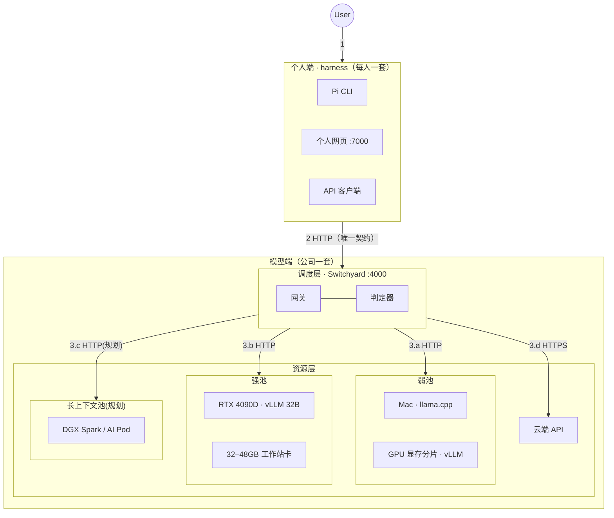
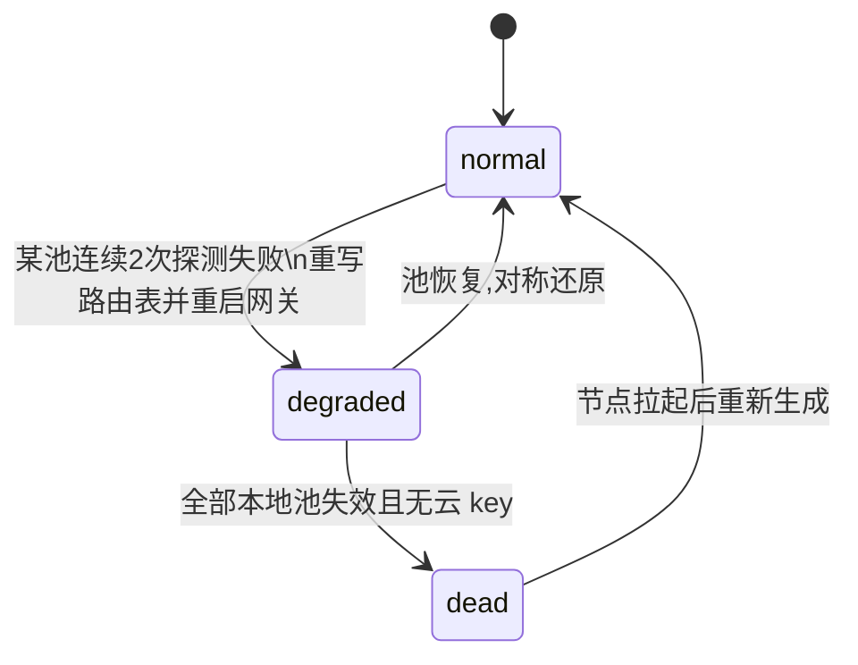

# AI 集群系统设计文档

三部分：系统设计、对外接口契约、实现与运维。接口变更先改第二部分，再改实现。

# 第一部分 · 系统设计

## 1. 概述

系统分两端，形态与 Claude Code 相同：harness 在用户这边，模型在另一边。

| 端 | 主要任务 | 装在哪 | 仓库目录 |
|---|---|---|---|
| 个人端 | harness：跟用户对话、执行工具、管理上下文 | 每个人自己的机器，一人一套 | `client/` |
| 模型端 | Switchyard 调度 + 推理：把请求派给合适的模型并算出答案 | 集群里的设备（GPU 机、Mac、大内存主机），公司共用一套 | `cluster/` |

两端之间只有一个契约：模型端的网关地址，加 OpenAI 格式的 HTTP。个人端不知道
集群怎么搭，模型端不知道用户用什么 harness；任一端可以整体替换而不动另一端。

### 1.1 个人端

个人端的全部工作是 harness，选型 Pi。它负责：

- 会话循环：把用户输入、历史、工具结果组成 `messages`，发给模型端；收到
  `tool_calls` 就在本机执行，把结果追加后再发。
- 工具执行：读写文件、跑命令，作用于用户自己的机器；接内部系统靠扩展。
- 上下文管理：按模型端声明的上下文窗口压缩历史。
- 界面：终端 `pi`，或一个只做对话的个人网页。

个人端不做模型选择。它只声明一个策略名（`auto`/`small`/`large`/`cloud`），
派给哪台机器、哪个模型由模型端决定。

个人端有两种用法，对应本机服务的两个入口：走 harness（Pi 在本机执行工具，
模型端只出答案），或者不走 harness 直接提交推理任务（一条 `ask`，或一批
`batch`，本机不执行任何东西）。自研部分是 Pi 的接线、本机服务和个人网页，
约 500 行。

### 1.2 模型端

模型端把 OpenAI 兼容的请求分发到多台机器上的推理引擎，云端 API 作为最后的
回退。内部分三层加一个控制平面：

| 部分 | 任务 | 实现 | 自研范围 |
|---|---|---|---|
| 调度层 | 决定请求去向：显式指定直通，其余由判定器分诊，答不好升级 | NVIDIA NeMo Switchyard | 无，仅配置 |
| 资源层 | 算出答案：每节点一个推理引擎进程；云端 API | vLLM / llama.cpp | 无，仅启动参数 |
| 控制平面 | 让上面两层持续可用：健康探测、路由表生成、进程生命周期、热插拔 | 自研 | 约 400 行 Python |
| 管理台 | 管理员看设备、模式、升级事件；节点登记 | FastAPI | 约 300 行 |

部署形态是企业内网里的若干台异构设备，每台装一次；其中一台是 Hub，运行网关、
控制平面和管理台。

### 1.3 两套安装包

| 安装包 | 目标机器 | 一条命令做完的事 |
|---|---|---|
| 模型端 `bin/install.sh` | 空白的 GPU 机或 Mac 节点 | 装服务 venv 与 Switchyard；GPU 机装 vLLM 并下载 32B-AWQ + 1.7B-FP8 权重，Mac 编译 llama.cpp 并下载 1.7B GGUF；然后直接 `cluster init`（第一台）或 `--join` 加入已有 Hub。装完即在服务 |
| 个人端 `bin/install-client.sh URL` | 每个人自己的机器 | 装 Pi（全局目录不可写时装到用户目录，不需要 sudo）；接线；拉起本机服务。装完即可 `client pi`、开网页、`client ask` |

两者都有 `bin/bootstrap.sh` 的 curl 一行式入口（克隆仓库再执行对应安装包）。
安装是幂等的，重跑只补缺的部分。

### 术语

| 术语 | 定义 |
|---|---|
| 个人端 | 用户机器上的 harness（Pi）及其界面。一人一套 |
| 模型端 | 网关、推理节点、控制平面、管理台的总称。公司一套 |
| harness | 跑 agent 循环的程序：组 messages、执行工具、管上下文。本设计选 Pi |
| 节点 | 运行推理引擎的一台物理设备。对外只有 OpenAI 格式 HTTP 和 `/health` |
| 池 | 一组可互换的节点。现有三个：弱池（小模型，默认流量）、强池（大模型）、云端 |
| Hub | 运行网关、集群管理台和控制平面的设备 |
| 路由表 | 网关的全部配置，由控制平面按当前健康的节点集合生成 |
| 判定器 | 复用弱池模型的一次分类调用，决定会话是否升级到强池 |
| 会话粘性 | 升级过的会话之后固定走强池 |
| 降级 | 某池失效后，路由表把它的流量改指云端或幸存池 |

## 2. 请求生命周期



1. 用户从 Pi 终端、个人网页或程序发起请求。
2. 个人端把输入包装成 OpenAI 格式：`model: "auto"` 加 `messages`。Anthropic
   格式的客户端由网关在入站时翻译，之后路径相同。
3. 网关决定去向，转发时把 `model` 改成目标节点的真实模型名。顺序：显式指定
   （`small`/`large`/`cloud`）直通；会话已升级的走强池；其余交判定器。判定器
   看的是对话轨迹，不是单条消息的难度；连续两次升级结论才生效，升级后不回落。
   「会话」由请求头 `x-switchyard-session-id` 标识，个人端的本机服务给每个请求
   都带上（网页每次新对话一个；Pi 等不带头的客户端按对话首条消息推导）。不经
   个人端、也不带这个头的第三方客户端，每轮都从零判定，不会锁定到强池。
4. 目标节点的引擎解码，返回带 `usage` 的响应。
5. 响应原路返回。`model` 字段是实际执行者，`auto` 不出现在响应里。
6. 响应里若带 `tool_calls`，个人端在本机执行工具，把结果追加进 `messages`
   后回到第 2 步。模型端不执行工具，也不保存两次请求之间的任何状态。

网关不探测健康、不管进程、不存请求内容。它的行为完全由路由表文件决定。

## 3. 硬件与池的映射

分池看两个硬件属性：内存带宽决定它适合稠密模型还是 MoE；是否常开决定它适合
承接高频流量还是按需启动。

| 池 | 硬件要求 | 现役 | 候选 |
|---|---|---|---|
| 弱池 | 常开、低功耗，算力要求低 | Mac（llama.cpp，CPU） | 24GB 卡上的显存分片；懒猫 AI Pod |
| 强池 | 高内存带宽（32B 稠密模型每 token 读一遍全部权重） | RTX 4090D 24GB（vLLM） | 32–48GB 工作站卡 |
| 长上下文池（规划） | 128GB 级统一内存（300B MoE 要容量不要带宽） | — | DGX Spark 单台或 2–4 台组网；懒猫 AI Pod 128GB。Perplexity Portable Computer 是同形态的商业成品 |
| 云端 | — | 未配 key | Together、Anthropic、OpenAI |

节点之间只走 HTTP，单请求 KB 级流量，千兆局域网够用。跨节点张量并行不在
本设计内：需要它的硬件组合（如多台 DGX Spark 的 RoCE 组网）作为一个节点接入，
组网细节留在节点内部。

## 4. 设备热插拔

加一台设备，等于给某个池加一个模型副本。已有设备的配置不变，服务不中断。
当前阶段副本的作用是故障转移：每个池只有一个在役节点，其余为备份，在役节点
失效时下一个请求起切换；同池多副本分摊流量要在池前加负载均衡层（见本节末
尾与路线图）。撤一台设备不需要任何操作。当前只覆盖三类硬件。

加入：

1. 新设备执行一次安装命令。第一台 `init` 成为 Hub，之后的用 `join <Hub> --token`。
2. 设备探测自身硬件，按 §3 定池，启动对应的引擎和模型，向 Hub 提交节点档案。
3. 控制平面按新的节点集合重新生成路由表，网关重载。

撤出对称：设备关机或断网，控制平面在两个探测周期内判定失效并从路由表摘除，
该池流量改走幸存节点或云端。设备回来后重新注册。

| 硬件 | 分配的池 | 状态 |
|---|---|---|
| NVIDIA 24GB 独显机 | 强池，卡上分片兼弱池 | 已验证 |
| 无独显的常开设备（Mac、小主机） | 弱池，可兼 Hub | 已验证 |
| 128GB 统一内存主机 | 长上下文池 | 规划 |

不在当前范围内：同池多台同型设备的负载分摊（Switchyard 每池只指向一个地址，
需要在池前加负载均衡层，候选是每池一个 nginx `least_conn` 或 sgl-router，
路由表生成器同时生成它的配置）；在途请求迁移到新设备（引擎不支持 KV 跨机迁移）；
自动发现和网页批准（现在用口令）。

实现状态：`init`、`link-gpu`、看门狗自愈已在真机验证；`join`（节点自探测、
自定池、向 Hub 注册接口登记）已实现，尚未在局域网双机环境验证。

## 5. 并发与产能

### 5.1 同时处理量

按引擎的工位数计。一个工位是一个请求专属的 KV cache 空间；超出的请求在引擎
排队，不失败。

| 部署形态 | 强池工位 | 弱池工位 | 同时在算 | 适合规模 |
|---|---|---|---|---|
| 标准盒（单 24GB 卡，弱池为卡上 1.7B 分片） | 2 | 8 | 10 | 10–20 人交互式使用 |
| Mac Hub + 远端 4090（当前验证部署） | 2 | 1（llama.cpp 单槽位） | 3 | 单人、演示 |

个人端和网关对在途请求没有实质上限（每请求一对连接和一个挂起协程），不计入。

### 5.2 每台设备每小时产能

单位是「个回答」，按每个回答 200 token 计。`每分钟回答数 = token/秒 × 60 ÷ 200`。

| 设备 / 池 | 聚合吞吐（token/秒） | 每分钟（个） | 每小时（个） |
|---|---|---|---|
| 4090D 强池（32B） | 38 | 约 11 | 约 660 |
| 4090D 弱池分片（1.7B，vLLM） | 108 | 约 32，扣判定器开销后约 27 | 约 1600 |
| Mac i9 弱池（1.7B，llama.cpp） | 14 | 约 4 | 约 250 |

一台标准盒每小时约 2200 个回答。产能与回答长度成反比，1000 token 的回答按
五分之一算。

## 6. 故障处理

控制平面在 Hub 上每 10 秒探测各节点 `/health`。连续两次失败判死：按幸存节点
重新生成路由表，重启网关，失效池的流量改指云端（有 key）或幸存池。节点恢复后
还原。控制平面不在数据路径上，它自己挂了不影响在途请求，只是没有自动降级。
状态枚举和监控判据见第二部分 §3.4，实现见第三部分 §4。

## 7. 两端的边界、隔离与放置

### 7.1 两端之间、各层之间互不依赖

个人端与模型端之间只有网关这一个 HTTP 端点；模型端内部层与层之间也只有
HTTP。没有共享内存、共享文件或进程内调用跨过任何边界；控制平面的文件接口只
在 Hub 内部。因此每一部分可以放在任何设备上，同机和分机只差一个网络地址。

| 边界 | 通信 | 进程关系 | 宿主关系 |
|---|---|---|---|
| 用户 → 个人端 | 终端或本机浏览器 | 每用户一个 harness 进程 | 用户自己的设备 |
| 个人端 → 模型端（网关） | HTTP（OpenAI/Anthropic 格式） | 独立进程 | 分机；同机时按 §7.3 |
| 调度层 → 资源层 | HTTP | 独立进程 | 通常分机；同机时按 §7.3 |
| 调度层 → 云端 | HTTPS | 外部服务 | 外网 |

两端各自可替换：个人端换成任何 OpenAI/Anthropic 客户端，模型端不感知；模型端
换掉引擎、加减节点、改路由策略，个人端不用重新配置。

### 7.2 个人端的放置

1. 可以和推理引擎同机。Pi 是 Node 进程，只用 CPU 和少量内存，不碰 GPU。
2. 推理分布在多台设备时，个人端可以放在任意设备上，包括用户自己的机器。

当前实现取第 2 种：个人端装在用户本机（`client/`），工具作用于用户自己的文件，
与 Claude Code 的本地模式同构。第 1 种（Hub 上按人托管 Pi 会话、浏览器零安装）
在路线图，届时 §7.3 的隔离要求成为硬性条件。

### 7.3 同机部署的隔离要求

| 维度 | 要求 |
|---|---|
| 资源 | harness 用独立系统用户运行，CPU/内存配额与引擎分离（cgroup 或容器）。agent 执行的编译等负载不得抢占引擎的 CPU 侧调度 |
| 故障 | 独立进程。harness 崩溃不影响引擎；引擎崩溃时 harness 收到 HTTP 错误，由路由表降级 |
| 安全 | Pi 在宿主上直接执行 shell，权限等于运行它的用户。生产环境不得以 root 运行于推理主机；工作区通过挂载限定 |
| 网络 | harness 只能访问网关端口。引擎端口（8001/8002）对 harness 所在用户或容器不可达 |

## 8. 非目标

- 跨节点张量并行（见 §3）。
- 请求级鉴权和计费。内网部署；对外暴露时在网关前加反向代理。
- 持久化对话和上传文件。上传内容只注入当次请求。
- 模型端执行工具或保存会话。工具在个人端执行，网关只透传 `tool_calls`。

# 第二部分 · 接口规格（API 文档）

> 模型端对外的全部接口，即个人端与模型端之间的契约。约定：Hub 地址记作 `HUB`（单机部署即 `http://127.0.0.1`）。
> 数据面统一 OpenAI 线格式；内网部署默认无鉴权（企业部署加反代鉴权，见第三部分 §6）。

## 0. 端口总览

| 端口 | 服务 | 面向谁 |
|---|---|---|
| `HUB:4000` | 网关（主 API） | 所有客户端 |
| `HUB:6006` | 集群管理台（网页 + 其配套 API、节点登记） | 管理员、加入的节点 |
| 本机 `:7000` | 个人端本机服务：个人网页、网关代理、harness 任务接口（仅 127.0.0.1） | 本人的浏览器与脚本 |
| 节点 `:8001` / `:8002` | 推理引擎（内部接口） | 仅网关调用，客户端不应直连 |

---

## 1. 主 API — 对话

### 1.1 `POST HUB:4000/v1/chat/completions`

发起一次对话/任务。OpenAI 线格式。

**请求字段**：

| 字段 | 类型 | 必填 | 说明 |
|---|---|---|---|
| `model` | string | 是 | **策略选择字**，枚举：`auto`（默认路径，系统自判）/ `small` / `large` / `cloud`（三个旁路，直通指定池） |
| `messages` | array | 是 | 对话内容。每项 `{role, content}`；`role ∈ {system, user, assistant}`；多轮对话按时间顺序排列 |
| `max_tokens` | int | 否 | 回答长度上限（建议填，默认值由引擎决定） |
| `temperature` | float | 否 | 随机度 0~2 |
| `stream` | bool | 否 | `true` 则以 SSE 流式返回（见 1.3） |
| `chat_template_kwargs` | object | 否 | 引擎扩展；本集群约定 `{"enable_thinking": false}` 关闭 Qwen3 思考模式（默认已关，显式开启才需要传） |
| `tools` | array | 否 | 工具声明（OpenAI function 格式）；agent 类客户端使用 |

**请求示例**：

```json
{
  "model": "auto",
  "messages": [
    { "role": "system", "content": "你是公司内部助手" },
    { "role": "user",   "content": "分析这份合同的违约风险" }
  ],
  "max_tokens": 1024
}
```

**响应（200）**：

```json
{
  "model": "qwen3-32b-awq",
  "choices": [ {
    "index": 0,
    "message": { "role": "assistant", "content": "主要风险有三处…" },
    "finish_reason": "stop"
  } ],
  "usage": { "prompt_tokens": 35, "completion_tokens": 210, "total_tokens": 245 }
}
```

响应中的 `model` 为实际执行者，`auto` 不出现在响应中；计量与审计以此字段为准。
`finish_reason ∈ {stop, length, tool_calls}`。

**错误**：

| 状态码 | 场景 | 响应体示例 |
|---|---|---|
| 404 | `model` 不在枚举内 | `{"error": {"message": "unknown model ..."}}` |
| 500 | 下游节点失联（路由表未及时降级的窗口内） | `{"message": "SwitchyardUpstreamError('upstream failed: ...')", "type": "internal_error", "code": "internal_chain_error"}` |
| 400 | 请求体格式非法（缺 messages 等） | 引擎/网关的校验信息原样透传 |

### 1.2 `POST HUB:4000/v1/messages`（Anthropic 方言入口）

同一个网关同时接受 Anthropic Messages 格式（供 Claude 系客户端零改动接入），
入站时翻译，语义与 1.1 相同。字段差异见第三部分 §3。

```json
{ "model": "auto", "max_tokens": 1024, "system": "你是公司内部助手",
  "messages": [ { "role": "user", "content": "分析这份合同的违约风险" } ] }
```

### 1.3 流式返回（`stream: true`）

SSE 流，每行一个 `data: {chunk}`，以 `data: [DONE]` 结束：

```
data: {"choices":[{"delta":{"role":"assistant"}}], "model":"qwen3-1.7b-gguf"}
data: {"choices":[{"delta":{"content":"主要"}}]}
data: {"choices":[{"delta":{"content":"风险…"}}]}
data: [DONE]
```

需要流式时也统计用量的，传 `"stream_options": {"include_usage": true}`。

---

## 2. 主 API — 目录与统计（只读）

### 2.1 `GET HUB:4000/v1/models`

列出可用的策略名与直连模型名：

```json
{ "object": "list", "data": [
  { "id": "auto" }, { "id": "small" }, { "id": "large" }, { "id": "cloud" },
  { "id": "qwen3-32b-awq" }, { "id": "qwen3-1.7b-gguf" } ] }
```

### 2.2 `GET HUB:4000/v1/routing/stats`

路由器累计账目（进程内统计，重启清零）：

```json
{ "total_requests": 9, "total_errors": 0,
  "total_tokens": { "prompt": 3200, "completion": 2674, "total": 5874 },
  "cost_estimate": { "total_cost": 0.0 },
  "classifier": { "total_requests": 4, "total_errors": 0 } }
```

`total_errors` 持续增长表示存在不可用的下游节点。`classifier.*` 为判定器自身的调用计数。

---

## 3. 集群管理台配套 API（`HUB:6006`）

### 3.1 `GET /` — 聊天页面（HTML）

### 3.2 `POST /api/chat`

网页专用的对话代理：请求体与 1.1 完全相同；响应在 1.1 基础上附加端到端延迟：

```json
{ ...同 1.1 响应..., "_console": { "latency_ms": 3216 } }
```

### 3.3 `POST /api/upload`（multipart/form-data，字段名 `file`）

上传文本类文件供对话引用。限制：≤2MB；仅文本（txt/md/csv/json/代码）。

```json
// 200
{ "name": "report.txt", "chars": 60, "truncated": false, "text": "第一季度营收…" }
// 400
{ "error": "File too large (2MB limit)" }
{ "error": "Only text files are supported for now ..." }
```

超过 12000 字符的内容截断返回并置 `truncated: true`。

### 3.4 `GET /api/status`

集群状态快照（页面每 5 秒轮询它）：

```json
{
  "mode": "normal",
  "lanes": { "large": true, "small": true },
  "devices": [
    { "name": "Hub — this Mac",
      "hw": "Intel Core i9-9880H · 16GB RAM · CPU inference", "ok": true,
      "items": [ {"label": "Router · Switchyard :4000", "ok": true},
                 {"label": "qwen3-1.7b-gguf · llama.cpp (CPU)", "ok": true} ],
      "last": { "latency_ms": 905, "completion_tokens": 13, "tok_s": 14.4, "at": "23:36:31" } },
    { "name": "GPU node — via SSH tunnel",
      "hw": "NVIDIA GeForce RTX 4090 D · 24564 MiB", "ok": true,
      "items": [ {"label": "qwen3-32b-awq · vLLM", "ok": true} ],
      "last": { "latency_ms": 1148, "completion_tokens": 11, "tok_s": 9.6, "at": "23:36:32" } }
  ],
  "stats": { "requests": 5, "tokens": 2187, "errors": 0 },
  "escalations": [ { "time": "2026-09-06 05:01:41",
                     "detail": "(turn 5): the task is outside the scope of the efficient tier ..." } ]
}
```

`mode` 枚举：`normal | degraded-large-small | degraded-large-cloud |
degraded-small-large | degraded-small-cloud | degraded-all-cloud | dead`。
`≠ normal` 即为告警条件。

---

## 4. 个人端本机接口（`127.0.0.1:7000`，仅本机）

不属于模型端契约，列在这里是因为脚本会用到。

| 接口 | 语义 |
|---|---|
| `GET /` | 个人网页 |
| `GET /api/config` | `{"gateway": "<模型端网关>", "agent": <本机是否装了 Pi>, "token": "<本次启动的口令>"}`。不带 CORS 头，其他源的网页读不到 |
| `* /v1/*` | 代理到模型端网关。补 `x-switchyard-session-id`：客户端带了就原样转，没带就按对话首条消息（含 system）哈希推导。POST 响应附加 `_client.latency_ms` 与 `_client.session` |
| `POST /api/agent` | 在本机跑一次 harness 任务：请求 `{"task", "lane", "cwd"}`，同步返回 `{"output", "exit", "cwd", "latency_ms"}`。Pi 以 `-p` 单次模式执行，工具作用于 `cwd`。必须带 `X-Client-Token`（来自 `/api/config`）和 `Content-Type: application/json` |

访问控制：`Host` 必须是回环地址（防 DNS 重绑定）；带 `Origin` 的请求只接受本服务
自己的源。命令行客户端不带 `Origin`，直接通过。这样浏览器里打开的其他网站无法
驱动 `/api/agent`，也无法经 `/v1` 消耗集群。

## 5. 节点内部接口（客户端勿直连，列出仅为完整性）

| 接口 | 说明 |
|---|---|
| `POST 节点:800x/v1/chat/completions` | 与 1.1 同格式，但 `model` 必须是该节点声明的真实模型名 |
| `GET 节点:800x/health` | 200 = 存活。网关健康探测与看门狗的依据 |


---

# 第三部分 · 技术实现与运维

> 按两端组织：§1 选型与版本；§2 个人端（harness）；§3–§6 模型端（调度层 /
> 资源层 / 硬件档位 / 控制平面）；§7 并发与容量；§8 运维。维护规则：接口变更先改第二部分契约；配置项变更先改
> 本部分对应规范节，再改脚本。

## 1. 技术选型与版本清单

| 组件 | 选型 | 验证版本 | 许可 | 版本约束 |
|---|---|---|---|---|
| 调度 | NVIDIA NeMo Switchyard | 0.2.0（PyPI） | Apache-2.0 | 需 Python ≥ 3.12；PyPI 版配置为 YAML，GitHub 主干为 TOML，勿混用文档 |
| GPU 推理 | vLLM | 0.28.0 | Apache-2.0 | CUDA 平台 |
| CPU/Mac 推理 | llama.cpp | b10819 / 源码构建 | MIT | 官方 macOS 二进制要求 ≥ 13.3，更旧系统需源码编译 |
| 备选 GPU 推理 | SGLang | 未部署 | Apache-2.0 | 见 §4.4 |
| Harness | Pi | 0.74.2 | 开源（pi.dev） | Node ≥ 22.14 可运行；0.75+ 需 Node ≥ 22.19 |
| 集群管理台 | FastAPI + uvicorn | — | MIT | 依赖 python-multipart |
| 个人网页服务 | Python 标准库 `http.server` | — | — | 员工机器零依赖 |
| 默认模型 | Qwen3 系（32B-AWQ / 1.7B） | — | Apache-2.0 | 生产部署应锁定权重 revision |

## 2. 个人端 · harness

### 2.1 Pi：选型理由与集成方式

个人端要薄，逻辑放在模型端。Pi 不需要改动，接入物只有一份 provider
配置文件。OpenHands 一类平台型 harness 自带路由和运行时，与调度层职责重叠，
不采用。

个人端是独立的一套（`client/`），装在每个人自己的机器上，与模型端不共享代码。
Pi 的 provider 指向本机服务（`127.0.0.1:7000/v1`）而不是直接指向网关：本机服务
是个人端唯一的出口，负责给每个请求补会话标识（第二部分 §4）；`client pi`
会先确保本机服务在跑。
安装与接线：`bin/install-client.sh http://<Hub>:4000`，等价于装 Pi 再执行
`bin/client setup --hub …`。后者写三样东西：`~/.pi/agent/models.json`（§2.2）、
`~/.pi/agent/settings.json`（默认 provider/model 为 `home/auto`；压缩阈值
`reserveTokens` 1024，因为我们的上下文窗口只有 5–8K，Pi 默认的 16384 会导致
永远触发压缩），以及把 `client/pi/extensions/*.ts` 同步到 `~/.pi/agent/extensions/`。
扩展是往 Pi 里加能力（内部系统、专用工具）的唯一位置：一个系统一个 TypeScript
文件，用 `pi.registerTool` 声明工具，不改 `setup.py`。

个人端的 CLI：

| 命令 | 语义 |
|---|---|
| `client setup --hub URL` | 接线；可重复执行，只覆盖 `home` provider；记住 URL，之后的命令可省略 `--hub` |
| `client up [--port 7000]` / `down` | 后台起停本机服务（§2.3）；pid 与日志在 `~/.cluster-client/` |
| `client pi [参数]` | 打开 Pi harness（走 `home/auto`） |
| `client ask "…" [--lane auto]` | 一次推理调用，不经 harness，本机不执行任何东西 |
| `client batch FILE [--lane] [-c 4] [-o out.jsonl]` | 一批提示词并发提交（jsonl 的 `prompt` 字段或每行一条），逐行输出结果，单条失败不中断 |
| `client status` | 接线、本机服务、Pi、网关可达性 |

### 2.2 provider 配置规范（`~/.pi/agent/models.json`）

```json
{
  "providers": {
    "home": {
      "baseUrl": "http://<Hub>:4000/v1",
      "api": "openai-completions",
      "apiKey": "home",
      "models": [
        { "id": "auto",  "name": "Cluster Auto",  "input": ["text"],
          "contextWindow": 5120, "maxTokens": 1024,
          "cost": { "input": 0, "output": 0, "cacheRead": 0, "cacheWrite": 0 } },
        { "id": "small", "contextWindow": 8192, "maxTokens": 1024, "input": ["text"],
          "cost": { "input": 0, "output": 0, "cacheRead": 0, "cacheWrite": 0 } },
        { "id": "large", "contextWindow": 5120, "maxTokens": 1024, "input": ["text"],
          "cost": { "input": 0, "output": 0, "cacheRead": 0, "cacheWrite": 0 } }
      ]
    }
  }
}
```

| 字段 | 约束 |
|---|---|
| `baseUrl` | 网关地址，以 `/v1` 结尾 |
| `api` | 固定 `openai-completions` |
| `apiKey` | 网关无鉴权，填任意非空串 |
| `models[].id` | 必须是路由表里存在的路由名 |
| `models[].contextWindow` | 不得超过对应池的引擎 `max-model-len`，否则 Pi 会构造超限请求收到 400 |
| `cost` | 本地池填零；该文件在 Pi 内 `/model` 时热加载 |

### 2.3 两个网页：个人前端与集群管理台

个人网页（个人端，`client/web/`，`:7000`，每人本机一份）：两个页签。Chat 是一次
推理调用，本机不执行任何东西；Agent 把任务交给本机的 Pi（`-p` 单次模式）在指定
工作目录里执行，模型端只出答案。车道选择 `auto/small/large/cloud`，每条回答标注
实际执行模型与端到端延迟。由 `client/serve.py` 托管，一个标准库 HTTP 服务：把
`/v1/*` 原样代理到网关（网页不需要网关开 CORS），并提供 `POST /api/agent`
（第二部分 §4）。不含上传、不含集群状态。

集群管理台（模型端，`cluster/access/console/`，Hub `:6006`，全集群一份）：设备
卡片（在线状态、硬件档案、最近一次解码指标）、路由策略说明（随 `cluster_mode`
变化）、升级事件流（判定器结论原文）、累计统计，以及节点登记接口
`POST /api/register`。保留一个带文件上传的对话区作为管理员测试入口。数据来源为
5 秒轮询 `GET /api/status`；接口规格见第二部分 §3。两个网页都不含路由逻辑。

### 2.4 第三方客户端接入

OpenAI SDK：

```python
from openai import OpenAI
client = OpenAI(base_url="http://<Hub>:4000/v1", api_key="home")
r = client.chat.completions.create(model="auto",
        messages=[{"role": "user", "content": "…"}])
```

Anthropic SDK（网关以 `--inbound both` 同时接受 Messages 格式）：

```python
from anthropic import Anthropic
client = Anthropic(base_url="http://<Hub>:4000", api_key="home")
r = client.messages.create(model="auto", max_tokens=1024,
        messages=[{"role": "user", "content": "…"}])
```

约束：内网无鉴权，`api_key` 任意非空；`model` 只接受路由名或节点真实模型名。

## 3. 模型端 · 调度层（Switchyard）

### 3.1 部署形态与启动参数

单 Python 进程，无状态，由控制平面启动与重启：

```
switchyard serve --routing-profiles state/routes.yaml \
                 --host 0.0.0.0 --port 4000 --inbound both
```

| 参数 | 说明 |
|---|---|
| `--routing-profiles` | 路由表文件（§3.2）。启动时一次性加载，改表须重启（秒级） |
| `--inbound both` | 同时接受 OpenAI 与 Anthropic 入站格式 |
| `--workers N` | 多进程。会话粘性表随进程分片，前置负载均衡需按会话哈希；单进程无此问题 |

网关不探测健康、不管理进程；配置非法时启动即退，错误定位单行输出到日志。

### 3.2 路由表规范（`state/routes.yaml`）

由 `cluster/router/routes.py` 按注册表与当前健康生成，手改会在下次生成时
被覆盖。顶层仅 `defaults` 与 `routes` 两键。

```yaml
defaults:
  api_key: home            # 本地引擎不校验,但字段必须非空

routes:
  auto:                    # 键名即客户端可用的 model 值
    type: escalation_router
    weak:
      model: qwen3-1.7b-gguf          # 必须等于该节点 served-model-name/-a 别名
      base_url: http://127.0.0.1:8002/v1
    strong:
      model: qwen3-32b-awq
      base_url: http://127.0.0.1:8001/v1
    judge:
      model: qwen3-1.7b-gguf
      base_url: http://127.0.0.1:8002/v1
      confirmations: 2                # ≥1;连续 N 次升级结论才生效
      disable_reasoning: true         # 判定器禁思考,保证 JSON 结论可解析
      max_completion_tokens: 512
    fallback_target_on_evict: strong  # 只能取 strong|weak;会话被 LRU 逐出后的去向
  small:
    type: model                       # 直通路由
    model: qwen3-1.7b-gguf
    base_url: http://127.0.0.1:8002/v1
  large:
    type: model
    model: qwen3-32b-awq
    base_url: http://127.0.0.1:8001/v1
  cloud:
    type: model
    model: <供应商模型 id>
    base_url: <供应商地址>/v1
    api_key: <真实 key>               # 仅此处出现,永不下发节点
    # format: anthropic_messages      # 后端为 Anthropic 协议时声明,网关负责翻译
```

字段约束：

| 字段 | 约束 |
|---|---|
| `routes.<name>` | name 即对外 model 枚举；未知键导致启动失败 |
| `type` | `model` 或 `escalation_router`（本系统只用这两种） |
| `weak/strong/judge.model` | 必须与节点声明的模型名逐字相等，否则上游 404 |
| `fallback_target_on_evict` | 必填；取值为 tier 名而非模型名 |
| 后端 `format` | 缺省 `openai_chat`；声明后网关做双向协议翻译（§3.4） |

生成器的降级语义（健康集合 → 路由表形态）：

| 健康状态 | auto | small | large | cluster_mode |
|---|---|---|---|---|
| 全健康 | escalation（弱→强） | 直通弱池 | 直通强池 | `normal` |
| 强池死，有云 key | 直通云端 | 直通弱池 | 直通云端 | `degraded-large-cloud` |
| 强池死，无 key | 直通弱池 | 直通弱池 | 直通弱池 | `degraded-large-small` |
| 弱池死 | 直通强池/云端 | 改指幸存方 | 直通强池 | `degraded-small-*` |
| 全死，有 key | 全部直通云端 | 同 | 同 | `degraded-all-cloud` |
| 全死，无 key | 生成失败，保留旧表 | — | — | `dead` |

### 3.3 路由策略

`auto` 路由的决策序列（每请求）：

1. 会话已在粘性表 → 强池，判定器不参与；
2. 轮次 < `min_judge_turn` → 弱池，不裁决；
3. 判定器读会话压缩视图（任务框架 + 最近 N 轮，每条截断），输出
   `{"escalate": bool, "reason": str}`。判据是轨迹（重复循环、假进展、
   跑偏、绝望动作），不是单条消息难度；
4. 连续 `confirmations` 次升级结论 → 会话写入粘性表，此后单向走强池；
   任何一次否定结论清零计数；
5. 判定器自身失败 → fail-open 停留弱池并计入 stats，不因判定器不可用
   误耗强池。

粘性表为进程内 LRU（上限 1 万会话），逐出后按 `fallback_target_on_evict`。
默认方向为「弱池先行」；准确性优先的部署可在生成器中对调 weak/strong
并为机械任务保留弱池白名单，属配置变更，不动代码。

### 3.4 协议翻译

每个后端在路由表中声明方言，翻译只发生在调度层，客户端与节点均无感知：

| OpenAI | Anthropic |
|---|---|
| `POST /v1/chat/completions` | `POST /v1/messages` |
| `Authorization: Bearer` | `x-api-key` + `anthropic-version` |
| `messages[role=system]` | 顶层 `system` 字段 |
| `content` 为字符串 | `content` 为类型化块数组 |
| `max_tokens` 可选 | `max_tokens` 必填（翻译时自动补） |
| `finish_reason` / `prompt_tokens` | `stop_reason` / `input_tokens` |

### 3.5 可观测性

| 接口 | 字段 | 告警判据 |
|---|---|---|
| `GET /v1/models` | 路由与模型目录 | 非 200 即网关不可用 |
| `GET /v1/routing/stats` | `total_requests/total_errors/total_tokens/cost_estimate/classifier.*` | `total_errors` 持续增长＝存在不可用下游；`classifier.total_errors` 增长＝判定器 fail-open 中，路由退化为「从不升级」 |

## 4. 模型端 · 资源层（推理引擎）

### 4.1 引擎选型矩阵

三个引擎分属两个生态位。对调度层而言它们只是一个 URL，
选型是节点内部决定，落在该节点的 preset 文件里。

```
该节点有 NVIDIA GPU?
 ├─ 有 → vLLM 或 SGLang(同生态位,二选一,按任务取舍,见下表)
 └─ 无 → Apple Silicon? MLX-LM : llama.cpp
```

vLLM 与 SGLang 的取舍按任务负载：

| 负载特征 | 倾向 | 依据 |
|---|---|---|
| 通用混合请求、求稳 | vLLM | 生态与模型适配最广，本系统已在 24GB 档完成校准 |
| 多轮 agent 会话、同模板批量任务占比高 | SGLang | RadixAttention 前缀复用，重复上下文不重算 |
| 结构化输出（JSON/语法约束）密集 | SGLang | 约束解码为其原生能力 |
| 硬件有官方部署菜谱（如 DGX Spark） | SGLang | 直接采用官方参数，省去校准 |

本文档不做全局钦定：同一集群内不同节点可用不同引擎。

### 4.2 vLLM 节点规范

参数由 preset 文件承载（`cluster/inference/presets/`）。24GB 档实测值：

| 参数 | 值（24GB 档） | 作用与约束 |
|---|---|---|
| `--served-model-name` | `qwen3-32b-awq` | 对外模型名，必须与路由表逐字一致 |
| `--gpu-memory-utilization` | 0.81 | 显存配额。校准方法见 §5.2 |
| `--max-model-len` | 5120 | 上下文上限，受 KV 池约束 |
| `--kv-cache-dtype` | `fp8` | KV 显存减半，24GB 双模型共存的必要条件 |
| `--max-num-seqs` / `--max-num-batched-tokens` | 8 / 1024 | 批上限。默认值按上千并发预留激活显存，单卡必须调低 |
| `--enable-auto-tool-choice --tool-call-parser hermes` | — | Pi 等带工具客户端的必要条件，缺失时请求直接 400 |
| `--reasoning-parser qwen3` | — | 思考内容与正文分离 |
| `--default-chat-template-kwargs` | `{"enable_thinking":false}` | Qwen3 默认开思考，会耗尽 max_tokens 导致空正文 |
| `--enforce-eager` | — | 放弃 CUDA graph 换 1–2GiB 显存 |

启动顺序：同卡双模型时大模型先启动。32B 冷启动瞬时峰值约
20.5GiB（AWQ 权重重排临时缓冲），需要整卡空闲；小模型驻留时原地重启大
模型必然 OOM，自愈流程因此采用分段重启（§8.2 案例 2）。

### 4.3 llama.cpp 节点规范

```
llama-server -m <model>.gguf --host 127.0.0.1 --port 8002 \
             -c 8192 --jinja --reasoning-budget 0 -a <对外模型名>
```

| 参数 | 说明 |
|---|---|
| `-m` | GGUF 权重。1.7B 档用 Q8_0（ModelScope 官方仓库仅提供该量化） |
| `--jinja --reasoning-budget 0` | 启用模板并禁思考，等价于 vLLM 侧的思考开关 |
| `-a` | 对外模型名，等价于 vLLM 的 `--served-model-name` |
| `--parallel N` | 槽位数，默认 1（串行）。槽位均分 `-c` 上下文，增并发以缩短单请求上下文为代价 |

构建：官方 macOS 二进制要求系统 ≥ 13.3；更旧系统源码编译
（`cmake -DGGML_METAL=OFF -DGGML_BLAS=OFF`，CPU-only 约 10 分钟）。

### 4.4 SGLang（预留）

替换动机与时机见 §4.1。接入方式与 vLLM 相同：新建 preset，声明启动命令与
参数，路由表无需变化。128GB 档（DGX Spark 单台或组网）优先采用官方
cookbook（docs.sglang.io 的模型菜谱，含 nvfp4 与多机配置），不自行校准。

### 4.5 云端后端

要求：OpenAI 或 Anthropic 兼容 HTTP。key 仅存于 Hub 的 `.env`
（`TOGETHER_API_KEY` 等），由生成器写入路由表的 cloud 路由，不下发节点、
不进日志。未配 key 时生成器用本地节点代替 cloud 路由，降级语义见 §3.2 表。
已知缺口：无预算上限与用量审批，降级期间云端费用不受控（路线图项）。

### 4.6 新模型接入流程

1. 确认可用量化。目标显存档位能装下的格式（AWQ/GPTQ/FP8/GGUF）与
   许可；记录权重仓库与 revision。注意运行时体积大于纸面体积：fp16 词表层
   与运行开销可多出 0.7–1.5GiB（4B-AWQ 实测运行时 3.2GiB）。
2. 建 preset。复制最近档位的 preset，改模型路径与对外名。
3. 定三项解析参数。该模型家族的工具调用解析器（Qwen3 为 `hermes`）、
   思考开关、reasoning parser。三者任一缺失的症状明确：工具请求 400、
   正文为空、思考混入正文。
4. 显存校准（GPU 节点）。从保守 `gpu-memory-utilization` 起步，逐步上调
   至引擎报出的 KV 池满足目标上下文；双模型共存时给整卡保留 ≥1GiB 余量
   （§5.2 的实测值）。
5. 验收。依次通过：`/health` 200；带 tools 请求不 400；短请求正文非空；
   `test.sh all`；破坏性演练 `test.sh failover`。全过后提交 preset。

## 5. 模型端 · 硬件档位

### 5.1 档位总表

| 档位 | 代表硬件 | 池角色 | 状态 |
|---|---|---|---|
| 24GB 独显 | RTX 4090/4090D | 强池（32B）＋判定器；可兼弱池分片 | 实测 |
| 12–16GB 独显 | 4070/4080 | 强池降档（8–14B） | 外推 |
| 32–48GB | 5090 / RTX 6000 Ada | 强池满上下文＋4B 弱池 | 外推 |
| 常开低功耗 | Mac、小主机 | 弱池、Hub | 实测（Intel Mac） |
| 128GB 统一内存 | DGX Spark、懒猫 AI Pod | 长上下文池（300B MoE 3–4bit） | 调研 |
| 组网舱 | 2–4× DGX Spark（RoCE） | 长上下文池，4bit | 调研 |

准确性优先的产品化部署以 24GB 档为最低配置；更小硬件仅作接入终端。

### 5.2 24GB 档校准记录

实测常数（RTX 4090D，vLLM 0.28，2026-09）：

| 量 | 值 |
|---|---|
| Qwen3-32B-AWQ 运行时权重 | 17.7 GiB |
| Qwen3-4B-AWQ 运行时权重 | 3.2 GiB（含 fp16 词表层 0.74 GiB） |
| 每进程 CUDA 上下文（记账外） | ~0.45 GiB |
| 32B 冷启动瞬时峰值 | ~20.5 GiB |
| 32B fp8 KV | 0.125 MiB/token |
| 稳态安全余量（OOM 演练后定值） | ≥1.1 GiB |

结论：32B-AWQ 与 4B-AWQ 无法在 24GB 共存（合计需求超可用约 1GiB），
弱池配 1.7B；4B 弱池需要 32GB+ 档。校准方法：固定批参数后二分
`gpu-memory-utilization`，以引擎报告的 KV 池 token 数满足目标上下文为准，
再以真实 agent 负载压测确认余量（曾在余量 80MiB 时被 94MiB 的运行时
分配打崩，故定 1.1GiB）。

### 5.3 组网舱

单台装不下且需要 4bit 质量的 300B MoE 时使用。原则：舱内的张量并行与
RoCE 配置出厂预置，对集群表现为一个节点、一个 URL；组网复杂度不越过
节点边界。

## 6. 模型端 · 控制平面

### 6.1 文件契约

| 文件 | 写者 | 读者 | 内容 |
|---|---|---|---|
| `state/routes.yaml` | router/routes.py | 网关 | 路由表 |
| `state/cluster_mode` | router/routes.py | 控制台、脚本、人 | 状态枚举（§6.2） |
| `state/nodes.json` | CLI（init/link-gpu）、注册接口（join） | routes 生成器、控制台 | 节点注册表：名称/池/模型/地址/硬件 |
| `state/preset` | CLI | heal | 本机 preset 名 |
| `state/join_token` | init | 注册接口 | 加入口令 |
| `cluster/inference/presets/*.env` | 人（校准后固化） | 编排脚本 | 节点档位参数 |
| `logs/*.info` | CLI 探测 | 控制台 | 设备硬件档案 |
| `logs/*.pid` | 各启动器 | stop/status/看门狗 | 进程句柄 |
| `.env` | 管理员 | router/routes.py | 云端凭据 |

### 6.2 健康与降级状态机



状态取值即 `state/cluster_mode` 枚举（§3.2 表）。探测周期 10 秒，判死
条件为连续 2 次失败；控制平面自身失效的判据是该文件时间戳超过 2×周期
不更新，此时数据面照常但失去自动降级能力。

### 6.3 CLI 规范（`bin/cluster`，即 `python3 -m cluster`）

| 命令 | 语义 | 前置条件 | 产物 | 失败行为 |
|---|---|---|---|---|
| `init [--preset P]` | 本机成为 Hub：探测硬件选 preset、起本地车道、登记注册表、发口令、生成路由表、起网关/控制台/看门狗 | 服务 venv 内有 switchyard | `state/nodes.json`、`state/preset`、`state/join_token`、各 pid | 单条车道失败不中断；无任何车道时网关延后至 join/link-gpu |
| `join HUB_URL --token T [--preset P]` | 本机加入已有 Hub：起本地车道后向 Hub 的 `/api/register` 登记 | Hub 可达 | Hub 侧注册表新增条目，看门狗下一拍重生成路由 | 口令错 403；登记失败退出 1 |
| `link-gpu "SSH_TARGET" [--port] [--model]` | Hub 经 SSH 隧道接入远端 GPU 节点并登记 | 免密 key | 隧道守护循环、注册表条目 | 隧道不通则拆隧道退出 1 |
| `status` | 注册表各节点健康、网关/控制台/看门狗存活、当前模式 | — | — | — |
| `stop` | 按 pid 全停（看门狗、控制台、网关、隧道、本地车道） | — | 清 pid | — |
| `regen` | 强制按当前健康重生成路由表并重启网关 | — | — | — |

单 GPU 机整机部署即 `init`（自动选 `qwen3-24gb` preset，先起强池再起弱池）；
`bin/install.sh` 装完自动执行它，所以空白机器一条命令即在服务。
HTTP 冒烟 `cluster/test.sh [small|large|router|console|pi|failover|all]`；其中 `pi`
一项需要本机已执行过 `bin/client setup`。

## 7. 并发与容量

### 7.1 各组件并发机制与饱和行为

见第一部分 §5 的表；本部分不重复。要点：唯一的压力点是
GPU 节点，机制为连续批处理，上限由 KV 池与批参数决定，饱和表现为排队。

### 7.2 容量规划方法

以池的聚合吞吐与目标回答长度估算，常数用实测值：

```python
# 24GB 档实测: 强池 38 tok/s(2 并发聚合), 弱池(vLLM) 108 tok/s(4 并发聚合)
def answers_per_minute(pool_tok_s: float, avg_answer_tokens: int = 200) -> float:
    return pool_tok_s * 60 / avg_answer_tokens

strong = answers_per_minute(38)        # ≈ 11 答/分钟
weak   = answers_per_minute(108)       # ≈ 32 答/分钟
# 判定器开销: 弱池有效容量 × 0.85
# 经验规模: 单标准盒支撑 10–20 人团队日常;超出则池内加节点或收窄任务
```

### 7.3 已知限制

无过载拒绝（不返回 429，只排队）；无租户配额与限流；llama.cpp 弱池默认
单槽位。三者均在路线图，不是设计选择。

## 8. 运维

### 8.1 监控

#### 8.1.1 指标体系

四类数据，每类给出指标、采集点与当前体现位置：

| 类别 | 指标 | 采集点 | 当前体现 | 目标形态 |
|---|---|---|---|---|
| 可用性 | 各节点 `/health`；网关 `/v1/models`；`cluster_mode` | 控制平面探测（10s） | 控制台徽章与设备红绿灯；`state/cluster_mode` | 告警：任一节点连续失败、mode≠normal |
| 容量与延迟 | 每池在途/等待请求数、KV 池占用、端到端延迟 p50/p95、首 token 延迟、tok/s | vLLM 原生 Prometheus `/metrics`（`num_requests_running/waiting`、`gpu_cache_usage_perc`）；控制台按模型记录最近解码 | 设备卡片「最近解码」（仅控制台流量） | Prometheus 抓取 + Grafana 时间序列；告警：等待队列深度持续>0、p95 超阈值 |
| 路由与质量 | 弱/强池请求占比、升级次数与理由、判定器调用数与失败率 | `/v1/routing/stats`；`switchyard.log` 中的升级记录 | 升级事件流面板；累计统计面板 | 升级率异常（过高＝弱池能力不足，过低＝判定器 fail-open）告警 |
| 成本 | 各池 token 数、云端调用次数与费用估算、降级持续时长 | `/v1/routing/stats.cost_estimate`；`watchdog.log` 时间戳 | 累计统计面板 | 云端费用日报；降级超过 N 分钟告警 |
| 硬件 | GPU 显存/利用率/温度、隧道存活 | `nvidia-smi`/DCGM exporter；隧道循环日志 | `remote_gpu.info`（静态） | Grafana GPU 面板 |

#### 8.1.2 探测清单（当前已实现）

| 探测对象 | 健康值 | 故障签名 | 证据位置 |
|---|---|---|---|
| 各节点 `/health` | 200 | 连接拒绝/超时；日志 `EngineDeadError` | `logs/vllm-*.log`、`logs/small.log` |
| 网关 `/v1/models` | 200 | 连接拒绝；配置错则启动日志单行 error | `logs/switchyard.log` |
| `stats.total_errors` | 不增长 | 持续增长＝下游不可用 | `/v1/routing/stats` |
| `stats.classifier.total_errors` | 不增长 | 增长＝判定器 fail-open，升级失效 | 同上 |
| 控制台 `/api/status.mode` | `normal` | `degraded-*` 为降级中 | 页面徽章 |
| 控制平面心跳 | `cluster_mode` 时间戳新鲜 | 过期＝失去自动降级 | `logs/watchdog.log` |

#### 8.1.3 告警规则（建议）

| 规则 | 条件 | 级别 |
|---|---|---|
| 池失效 | 任一池 `/health` 连续 2 次失败 | P1 |
| 降级持续 | `cluster_mode ≠ normal` 超过 10 分钟 | P2 |
| 队列积压 | 任一池 `num_requests_waiting > 0` 持续 5 分钟 | P2 |
| 判定器失效 | `classifier.total_errors` 5 分钟内增长 | P2 |
| 控制平面失联 | `cluster_mode` 文件超过 30 秒未更新 | P1 |
| 云端超支 | 日费用估算超预算 | P2 |

现状：可用性与路由类指标已有实时体现（控制台 + 状态文件）；容量、成本、硬件类
只有采集点没有时间序列存储，Prometheus/Grafana 接入为路线图项。

### 8.2 故障手册（含真实案例）

**案例 1：强池运行中 OOM。** 症状：请求 500，`vllm-large.log` 出现
`torch.OutOfMemoryError`（实例：`Tried to allocate 94.00 MiB … 66.44 MiB is free`）
继而 `EngineDeadError`。根因：稳态余量不足，真实负载激活峰值超过启动期
profiling。处置：看门狗自动降级并自愈，无需人工；复发则下调该节点
`max-num-batched-tokens` 或 utilization。预防：余量 ≥1.1GiB（§5.2）。

**案例 2：强池自愈失败。** 症状：降级后长时间不恢复，`heal.log` 中 32B
启动 OOM。根因：冷启动峰值 20.5GiB 需整卡，弱池驻留时原地重启必败。
处置：自愈脚本已实现分段重启（先撤弱池腾卡）；若仍失败查
`logs/watchdog.log` 与 `heal.log`。

**案例 3：远端节点断连（隧道）。** 症状：`cluster_mode` 变
`degraded-large-*`，设备卡片红点。处置：隧道循环每 5 秒自动重连；对端
关机则属预期降级，恢复后 `cluster link-gpu …` 归队。

**案例 4：网关启动即退。** 症状：`/v1/models` 连接拒绝，
`switchyard.log` 单行 `error: invalid route bundle: …`。根因：路由表字段
非法（常见：`fallback_target_on_evict` 填了模型名而非 tier 名）。处置：
按错误行修生成器，勿手改生成文件。

**案例 5：回答为空但请求 200。** 症状：`content` 为空串。根因：模型思考
模式未关，思考耗尽 `max_tokens`。处置：确认节点启动参数含思考开关
（vLLM `--default-chat-template-kwargs`，llama.cpp `--reasoning-budget 0`）。

**案例 6：带工具请求 400。** 症状：Pi 首次调用即报
`"auto" tool choice requires --enable-auto-tool-choice`。处置：补
`--enable-auto-tool-choice --tool-call-parser <family>` 后重启节点。

### 8.3 安全边界

内网部署默认无鉴权；对外暴露必须在 4000/6006 前置反向代理鉴权。个人端本机
服务只绑回环地址，且按第二部分 §4 校验 `Host`/`Origin`，`/api/agent` 另要口令；
它在用户机器上执行的一切以用户身份进行。云端
key 只存 Hub 的 `.env`。上传文件不落盘，仅注入当次请求；对话不持久化。
除显式 `cloud` 路由与降级模式外，数据不出内网。云端用量无预算护栏，
为已知缺口。

## 附录 A：端口与进程清单

| 设备 | 进程 | 端口 |
|---|---|---|
| Hub | Switchyard 网关 / 集群管理台 / 弱池引擎 / 看门狗 /（多机时）SSH 隧道循环 | 4000 / 6006 / 8002 |
| 用户机器 | Pi 进程 /（可选）个人网页服务 | — / 7000（仅本机） |
| GPU 节点 | vLLM 强池引擎 | 8001 |

## 附录 B：OpenAI / Anthropic 协议对照速查

见 §3.4 映射表；完整请求示例见 第二部分 §1.1 与 §1.2。

## 附录 C：版本兼容性记录

| 事项 | 记录 |
|---|---|
| nemo-switchyard | 需 Python ≥ 3.12；PyPI 0.2.0 配置为 YAML bundle，GitHub 主干文档描述的是 TOML 新 API，按安装来源对号 |
| llama.cpp 官方 macOS 二进制 | 依赖 macOS ≥ 13.3 的 Accelerate 符号；13.1 需源码编译 |
| Pi 0.75+ | 需 Node ≥ 22.19（0.74.2 可在 22.14 运行） |
| Qwen3-1.7B GGUF（ModelScope 官方仓） | 仅提供 Q8_0 量化 |
| vLLM 0.28 + Qwen3 | 工具解析器为 `hermes`；思考默认开启，需显式关闭 |
| 大文件下载 | 国内网络下断点续传重试循环为必要实践（curl -C - 循环） |
