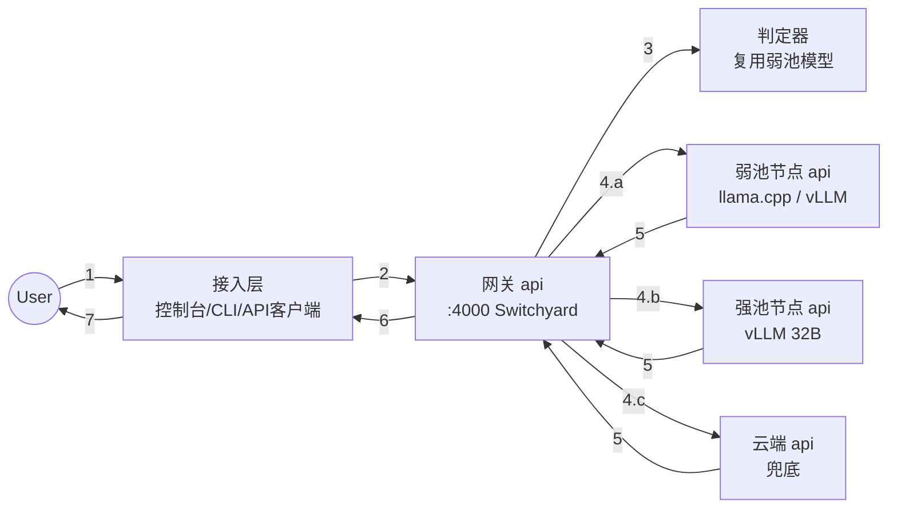
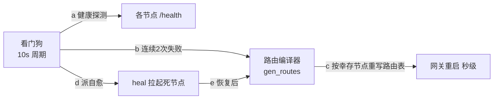

# AI 集群系统设计文档

## 目标

这个文档是 AI 集群项目的系统设计文档，整体涉及网关 API、推理节点 API、控制平面的
设计和技术选型。产品目标：企业若干台异构设备（GPU 机、Mac、大内存主机）各自一键
安装后组成一个集群，全公司通过一个内网入口使用；任务默认由弱池小模型承接，
判定超纲自动升级强池，本地全灭自动切云端 API 兜底。

环境（当前参考部署，已真机验证）：

- Hub：Intel Mac，16GB 内存（网关 + 控制台 + 弱池 CPU 推理）
- GPU 节点：RTX 4090D 24GB，Ubuntu 22.04（强池，32B 模型）
- 扩展形态：同构节点可加入同一池做负载均衡；128GB 大内存主机可加长文档池

## 整体流程图

### 单次请求处理流程图

- **1** 用户动作：聊天框输入 / CLI 指令 / 程序调用
- **2** 接入层包装成 OpenAI 格式（`model:"auto"` + `messages`）发给网关
- **3** 网关执行路由策略：查会话粘性表 → 未升级的会话由判定器读对话轨迹打分
- **4.a** 默认路径：弱池节点执行 ｜ **4.b** 判定确认超纲：强池执行（会话单向固定）
  ｜ **4.c** 路由表处于降级模式：云端执行
- **5→7** 响应原路返回；`model` 字段如实标注实际执行者

### 故障切换流程图

控制平面独立于数据路径：故障处理是查表降级（死节点的池 → 云端或幸存池），
恢复方向对称、全自动。

## 局部说明

### 1. 接入层（步骤 1、2、6、7）

- **走向**：三个互不依赖的客户端（网页控制台 :6006、CLI agent、原生 API 调用方）
  都只认网关一个端点；控制台额外提供文件上传（文本注入对话，不落盘）。
- **技术**：控制台为 FastAPI + 单页 HTML；CLI 为 Pi（零改动接线）。
- **高并发与多线程**：**异步事件循环，不用多线程**。接入层只做转发和包装，
  是纯 I/O 负载——单进程 async 即可支撑数百并发连接；无共享可变状态，
  故无锁、无线程安全问题。压力永远到不了这一层。

### 2. 网关 api（步骤 2→4，调度核心）

- **走向**：收到请求后三选一——显式指定（small/large/cloud）直通；`auto` 且会话
  已升级过 → 直接强池；`auto` 且未升级 → 交判定器。转发时把 `model` 改写成
  目标节点的真实模型名；对声明不同方言的后端（OpenAI/Anthropic 格式）双向翻译。
- **技术**：NVIDIA NeMo Switchyard，零改动；路由表由控制平面生成的 YAML 完全定义。
- **高并发与多线程**：无状态异步代理，纯 I/O，非瓶颈；会话粘性表是进程内
  LRU（上限 1 万会话）。需要更高吞吐时用 `--workers N` 起多进程（而不是多线程；
  粘性表随进程分片，同会话由负载均衡哈希到同进程——多进程部署时的注意点）。

### 3. 判定器（步骤 3）

- **走向**：读会话的压缩视图（任务框架 + 最近几轮），输出
  `{escalate: bool, reason}`；连续确认才升级；自身故障 fail-open 留弱池。
- **技术**：复用弱池模型（不占额外显存），关闭思考模式，限制输出长度。
- **高并发**：每次裁决 = 一次弱池调用，**容量规划按弱池负载 +10–20% 计**；
  有轮次门槛（早期轮次不裁决）天然限流。

### 4. 弱池节点 api（步骤 4.a，承接约八成流量）

- **走向**：接收网关改写后的请求，执行，带 `usage` 返回。
- **技术**：GPU 上为 vLLM，CPU/Mac 上为 llama.cpp；引擎是节点内部实现，
  上层只见 OpenAI 格式 HTTP + `/health`。
- **高并发与多线程**：**GPU 推理的并发不靠多线程，靠连续批处理**——引擎把
  所有在途请求合并成一个动态 GPU 批次，每步并入新请求、移出完成的。上限由
  KV cache 池和 `--max-num-seqs` 钉死：当前 vLLM 弱池实测 4 路并发 108 tok/s；
  Mac llama.cpp 当前单槽位（`--parallel N` 可换并发，槽位切分上下文）。
  **超载行为是排队降速，不是报错。**

### 5. 强池节点 api（步骤 4.b，破局用）

- **走向**：只接两类流量——显式 `large` 和判定器升级的会话，故队列天然短
  （这是分诊架构的并发红利）。
- **技术**：vLLM + 真机校准的显存档位（24GB：32B-AWQ，安全余量 1.1GiB）。
- **高并发**：机制同弱池；24GB 档实测 ~1–2 路满上下文并发（38 tok/s@2）。
  扩容路径 = 池内加同型节点（Switchyard 多目标负载均衡），架构零改动。

### 6. 云端 api（步骤 4.c，兜底）

- **走向**：仅两种情况到达——路由表降级模式（本地节点死亡）、或显式 `cloud`。
  凭据只存 Hub，永不下发节点。
- **高并发**：供应商侧近乎无限；我们侧是异步透传。缺口：预算上限与审批
  （路线图，防止降级期间云端费用失控）。

### 7. 控制平面（虚线流程 a–e）

- **走向**：见故障切换流程图；产物只有文件（路由表、状态字 `cluster_mode`、
  操作日志）和进程信号。
- **技术**：约 400 行 shell（探测/编译/自愈/生命周期），文件即接口。
- **高并发与多线程**：**单线程循环足够**——控制平面不在数据路径上，负载与
  用户量无关（10s 一拍）。刻意不用并发原语：控制逻辑的正确性优先于速度。

## 与参考架构（裂缝检测系统）的两处对应差异

1. 参考图有「对象存储」：本系统刻意没有——文件上传只作为文本注入当次对话，
   不落盘不留存（企业数据最小驻留原则）；需要留存时再加对象存储组件，挂在
   接入层之后，不影响其他部分。
2. 参考图的 Yolo/Vlm 分工对应本系统的弱池/强池：同为「便宜模型走量、
   贵模型压阵」的两级结构，本系统多一个判定器让升级自动化。

## 高并发总纲（一句话版）

压力只存在于 GPU 节点，交给连续批处理；网关和接入层是异步转发者；控制平面
与用户量无关；**分诊本身就是并发策略**（八成流量引向弱池，强池队列因此短）；
横向扩容 = 池内加节点。已知缺口：过载保护（429）、租户配额、Mac 多槽位
——详见 tech.md §7。
