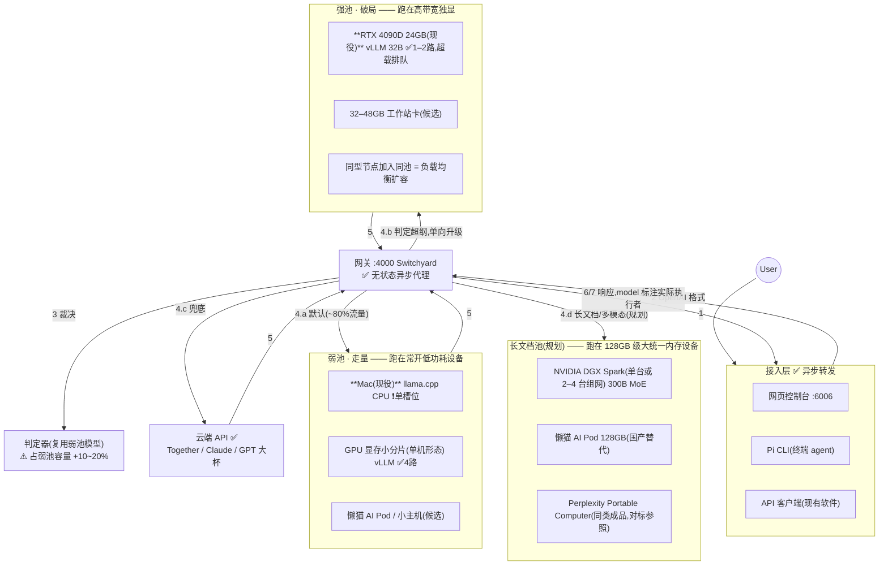

# AI 集群系统设计文档

> 本文档是唯一的系统主文档，分三部分：
> **第一部分 系统设计**（目标/流程图/逐组件走向与并发）·
> **第二部分 接口规格**（每个 API 的格式与示例）·
> **第三部分 技术溯源**（每个接口背后的实现与连接）

# 第一部分 · 系统设计

## 目标

这个文档是 AI 集群项目的系统设计文档，整体涉及网关 API、推理节点 API、控制平面的
设计和技术选型。产品目标：企业若干台异构设备（GPU 机、Mac、大内存主机）各自一键
安装后组成一个集群，全公司通过一个内网入口使用；任务默认由弱池小模型承接，
判定超纲自动升级强池，本地全灭自动切云端 API 兜底。

环境（当前参考部署，已真机验证）：

- Hub：Intel Mac，16GB 内存（网关 + 控制台 + 弱池 CPU 推理）
- GPU 节点：RTX 4090D 24GB，Ubuntu 22.04（强池，32B 模型）
- 扩展形态：同构节点可加入同一池做负载均衡；128GB 大内存主机可加长文档池

## 整体流程图（总图：请求流转 × 池子 × 硬件）

编号 1–7 为请求路径。并发标注：✅ 支持高并发 ｜ ⚠️ 占容量 ｜ ❗ 当前排队串行。
每个池子的方框内列出「它跑在什么硬件上」：加粗为现役，其余为候选/规划档。



**编号说明**：

- **1** 用户动作，三入口任选：网页聊天框 / **Pi**（终端 agent）/ 程序直调 API
- **2** 接入层包装成 OpenAI 格式（`model:"auto"` + `messages`）
- **3** 网关查会话粘性表；未升级的会话交判定器读对话轨迹打分
- **4.a** 默认走弱池 ｜ **4.b** 确认超纲走强池（会话单向固定）｜
  **4.c** 本地失效时走云端 ｜ **4.d** 长文档/看图任务走大内存池（规划档）
- **5→7** 响应原路返回，`model` 字段如实标注实际执行者

**硬件 → 池子的分工原则**（一句话）：常开低功耗设备当弱池（高频便宜活 24h 在线），
高带宽独显当强池（稠密大模型吃带宽），128GB 级大统一内存设备当长文档池
（300B MoE 吃容量不吃带宽），云端当保险。同池可放多台同型节点做负载均衡。

节点健康探测与故障自动切换由后台控制平面处理（查表降级、对称恢复、
与请求路径互不阻塞），细节见第三部分 §4，不在本图展开。

## 局部说明

### 1. 接入层（步骤 1、2、6、7）

- **走向**：三个互不依赖的客户端（网页控制台 :6006、CLI agent、原生 API 调用方）
  都只认网关一个端点；控制台额外提供文件上传（文本注入对话，不落盘）。
- **技术**：控制台为 FastAPI + 单页 HTML；CLI 为 Pi（零改动接线）。
- **高并发与多线程**：**异步事件循环，不用多线程**。接入层只做转发和包装，
  是纯 I/O 负载——单进程 async 即可支撑数百并发连接；无共享可变状态，
  故无锁、无线程安全问题。压力永远到不了这一层。

### 2. 网关 api（步骤 2→4，调度核心）

- **走向**：收到请求后三选一——显式指定（small/large/cloud）直通；`auto` 且会话
  已升级过 → 直接强池；`auto` 且未升级 → 交判定器。转发时把 `model` 改写成
  目标节点的真实模型名；对声明不同方言的后端（OpenAI/Anthropic 格式）双向翻译。
- **技术**：NVIDIA NeMo Switchyard，零改动；路由表由控制平面生成的 YAML 完全定义。
- **高并发与多线程**：无状态异步代理，纯 I/O，非瓶颈；会话粘性表是进程内
  LRU（上限 1 万会话）。需要更高吞吐时用 `--workers N` 起多进程（而不是多线程；
  粘性表随进程分片，同会话由负载均衡哈希到同进程——多进程部署时的注意点）。

### 3. 判定器（步骤 3）

- **走向**：读会话的压缩视图（任务框架 + 最近几轮），输出
  `{escalate: bool, reason}`；连续确认才升级；自身故障 fail-open 留弱池。
- **技术**：复用弱池模型（不占额外显存），关闭思考模式，限制输出长度。
- **高并发**：每次裁决 = 一次弱池调用，**容量规划按弱池负载 +10–20% 计**；
  有轮次门槛（早期轮次不裁决）天然限流。

### 4. 弱池节点 api（步骤 4.a，承接约八成流量）

- **走向**：接收网关改写后的请求，执行，带 `usage` 返回。
- **技术**：GPU 上为 vLLM，CPU/Mac 上为 llama.cpp；引擎是节点内部实现，
  上层只见 OpenAI 格式 HTTP + `/health`。
- **高并发与多线程**：**GPU 推理的并发不靠多线程，靠连续批处理**——引擎把
  所有在途请求合并成一个动态 GPU 批次，每步并入新请求、移出完成的。上限由
  KV cache 池和 `--max-num-seqs` 钉死：当前 vLLM 弱池实测 4 路并发 108 tok/s；
  Mac llama.cpp 当前单槽位（`--parallel N` 可换并发，槽位切分上下文）。
  **超载行为是排队降速，不是报错。**

### 5. 强池节点 api（步骤 4.b，破局用）

- **走向**：只接两类流量——显式 `large` 和判定器升级的会话，故队列天然短
  （这是分诊架构的并发红利）。
- **技术**：vLLM + 真机校准的显存档位（24GB：32B-AWQ，安全余量 1.1GiB）。
- **高并发**：机制同弱池；24GB 档实测 ~1–2 路满上下文并发（38 tok/s@2）。
  扩容路径 = 池内加同型节点（Switchyard 多目标负载均衡），架构零改动。

### 6. 云端 api（步骤 4.c，兜底）

- **走向**：仅两种情况到达——路由表降级模式（本地节点死亡）、或显式 `cloud`。
  凭据只存 Hub，永不下发节点。
- **高并发**：供应商侧近乎无限；我们侧是异步透传。缺口：预算上限与审批
  （路线图，防止降级期间云端费用失控）。

### 7. 控制平面（后台机制，不在总图）

- **走向**：后台独立循环——探测节点健康 → 节点生死变化时重写路由表并秒级重启网关 → 自愈拉起死节点。产物只有文件（路由表、状态字 `cluster_mode`、
  操作日志）和进程信号。
- **技术**：约 400 行 shell（探测/编译/自愈/生命周期），文件即接口。
- **高并发与多线程**：**单线程循环足够**——控制平面不在数据路径上，负载与
  用户量无关（10s 一拍）。刻意不用并发原语：控制逻辑的正确性优先于速度。

## 与参考架构（裂缝检测系统）的两处对应差异

1. 参考图有「对象存储」：本系统刻意没有——文件上传只作为文本注入当次对话，
   不落盘不留存（企业数据最小驻留原则）；需要留存时再加对象存储组件，挂在
   接入层之后，不影响其他部分。
2. 参考图的 Yolo/Vlm 分工对应本系统的弱池/强池：同为「便宜模型走量、
   贵模型压阵」的两级结构，本系统多一个判定器让升级自动化。

## 高并发总纲（一句话版）

压力只存在于 GPU 节点，交给连续批处理；网关和接入层是异步转发者；控制平面
与用户量无关；**分诊本身就是并发策略**（八成流量引向弱池，强池队列因此短）；
横向扩容 = 池内加节点。已知缺口：过载保护（429）、租户配额、Mac 多槽位
——详见第三部分 §7。


---

# 第二部分 · 接口规格（API 文档）

> 集群对外的全部接口。约定：Hub 地址记作 `HUB`（单机部署即 `http://127.0.0.1`）。
> 数据面统一 OpenAI 线格式；内网部署默认无鉴权（企业部署加反代鉴权，见第三部分 §6）。

## 0. 端口总览

| 端口 | 服务 | 面向谁 |
|---|---|---|
| `HUB:4000` | 网关（主 API，一切请求的正门） | 所有客户端 |
| `HUB:6006` | 控制台（网页 + 其配套 API） | 浏览器用户 |
| 节点 `:8001` / `:8002` | 推理引擎（内部接口） | 仅网关调用，客户端不应直连 |

---

## 1. 主 API — 对话

### 1.1 `POST HUB:4000/v1/chat/completions`

发起一次对话/任务。OpenAI 线格式。

**请求字段**：

| 字段 | 类型 | 必填 | 说明 |
|---|---|---|---|
| `model` | string | 是 | **策略选择字**，枚举：`auto`（默认路径，系统自判）/ `small` / `large` / `cloud`（三个旁路，直通指定池） |
| `messages` | array | 是 | 对话内容。每项 `{role, content}`；`role ∈ {system, user, assistant}`；多轮对话按时间顺序排列 |
| `max_tokens` | int | 否 | 回答长度上限（建议填，默认值由引擎决定） |
| `temperature` | float | 否 | 随机度 0~2 |
| `stream` | bool | 否 | `true` 则以 SSE 流式返回（见 1.3） |
| `chat_template_kwargs` | object | 否 | 引擎扩展；本集群约定 `{"enable_thinking": false}` 关闭 Qwen3 思考模式（默认已关，显式开启才需要传） |
| `tools` | array | 否 | 工具声明（OpenAI function 格式）；agent 类客户端使用 |

**请求示例**：

```json
{
  "model": "auto",
  "messages": [
    { "role": "system", "content": "你是公司内部助手" },
    { "role": "user",   "content": "分析这份合同的违约风险" }
  ],
  "max_tokens": 1024
}
```

**响应（200）**：

```json
{
  "model": "qwen3-32b-awq",
  "choices": [ {
    "index": 0,
    "message": { "role": "assistant", "content": "主要风险有三处…" },
    "finish_reason": "stop"
  } ],
  "usage": { "prompt_tokens": 35, "completion_tokens": 210, "total_tokens": 245 }
}
```

关键语义：响应里的 `model` 是**实际执行者**（`auto` 永远不会出现在响应里）——
这是全系统「谁干的活」的唯一事实来源。`finish_reason ∈ {stop, length, tool_calls}`。

**错误**：

| 状态码 | 场景 | 响应体示例 |
|---|---|---|
| 404 | `model` 不在枚举内 | `{"error": {"message": "unknown model ..."}}` |
| 500 | 下游节点失联（路由表未及时降级的窗口内） | `{"message": "SwitchyardUpstreamError('upstream failed: ...')", "type": "internal_error", "code": "internal_chain_error"}` |
| 400 | 请求体格式非法（缺 messages 等） | 引擎/网关的校验信息原样透传 |

### 1.2 `POST HUB:4000/v1/messages`（Anthropic 方言入口）

同一个网关同时接受 Anthropic Messages 格式（供 Claude 系客户端零改动接入），
入站即翻译，语义与 1.1 完全等价。字段差异见第三部分 §3。

```json
{ "model": "auto", "max_tokens": 1024, "system": "你是公司内部助手",
  "messages": [ { "role": "user", "content": "分析这份合同的违约风险" } ] }
```

### 1.3 流式返回（`stream: true`）

SSE 流，每行一个 `data: {chunk}`，以 `data: [DONE]` 结束：

```
data: {"choices":[{"delta":{"role":"assistant"}}], "model":"qwen3-1.7b-gguf"}
data: {"choices":[{"delta":{"content":"主要"}}]}
data: {"choices":[{"delta":{"content":"风险…"}}]}
data: [DONE]
```

需要流式时也统计用量的，传 `"stream_options": {"include_usage": true}`。

---

## 2. 主 API — 目录与统计（只读）

### 2.1 `GET HUB:4000/v1/models`

列出可用的策略名与直连模型名：

```json
{ "object": "list", "data": [
  { "id": "auto" }, { "id": "small" }, { "id": "large" }, { "id": "cloud" },
  { "id": "qwen3-32b-awq" }, { "id": "qwen3-1.7b-gguf" } ] }
```

### 2.2 `GET HUB:4000/v1/routing/stats`

路由器累计账目（进程内统计，重启清零）：

```json
{ "total_requests": 9, "total_errors": 0,
  "total_tokens": { "prompt": 3200, "completion": 2674, "total": 5874 },
  "cost_estimate": { "total_cost": 0.0 },
  "classifier": { "total_requests": 4, "total_errors": 0 } }
```

`total_errors` 增长 = 下游在挂；`classifier.*` 是判定器（judge）自身的调用账目。

---

## 3. 控制台配套 API（`HUB:6006`）

### 3.1 `GET /` — 聊天页面（HTML）

### 3.2 `POST /api/chat`

网页专用的对话代理：请求体与 1.1 完全相同；响应在 1.1 基础上附加端到端延迟：

```json
{ ...同 1.1 响应..., "_console": { "latency_ms": 3216 } }
```

### 3.3 `POST /api/upload`（multipart/form-data，字段名 `file`）

上传文本类文件供对话引用。限制：≤2MB；仅文本（txt/md/csv/json/代码）。

```json
// 200
{ "name": "report.txt", "chars": 60, "truncated": false, "text": "第一季度营收…" }
// 400
{ "error": "File too large (2MB limit)" }
{ "error": "Only text files are supported for now ..." }
```

超过 12000 字符的内容截断返回并置 `truncated: true`。

### 3.4 `GET /api/status`

集群状态快照（页面每 5 秒轮询它）：

```json
{
  "mode": "normal",
  "lanes": { "large": true, "small": true },
  "devices": [
    { "name": "Hub — this Mac",
      "hw": "Intel Core i9-9880H · 16GB RAM · CPU inference", "ok": true,
      "items": [ {"label": "Router · Switchyard :4000", "ok": true},
                 {"label": "qwen3-1.7b-gguf · llama.cpp (CPU)", "ok": true} ],
      "last": { "latency_ms": 905, "completion_tokens": 13, "tok_s": 14.4, "at": "23:36:31" } },
    { "name": "GPU node — via SSH tunnel",
      "hw": "NVIDIA GeForce RTX 4090 D · 24564 MiB", "ok": true,
      "items": [ {"label": "qwen3-32b-awq · vLLM", "ok": true} ],
      "last": { "latency_ms": 1148, "completion_tokens": 11, "tok_s": 9.6, "at": "23:36:32" } }
  ],
  "stats": { "requests": 5, "tokens": 2187, "errors": 0 },
  "escalations": [ { "time": "2026-09-06 05:01:41",
                     "detail": "(turn 5): the task is outside the scope of the efficient tier ..." } ]
}
```

`mode` 枚举：`normal | degraded-large-small | degraded-large-cloud |
degraded-small-large | degraded-small-cloud | degraded-all-cloud | dead`。
`≠ normal` 即为告警条件。

---

## 4. 节点内部接口（客户端勿直连，列出仅为完整性）

| 接口 | 说明 |
|---|---|
| `POST 节点:800x/v1/chat/completions` | 与 1.1 同格式，但 `model` 必须是该节点声明的真实模型名 |
| `GET 节点:800x/health` | 200 = 存活。网关健康探测与看门狗的依据 |


---

# 第三部分 · 技术溯源（每个接口背后是什么、怎么连接）

> 与第二部分配套：那边定义「接口长什么样」，这边说明「谁在实现它、
> 请求怎么流动、部件之间靠什么连接」。

## 1. 分层与选型总表

| 层 | 组件 | 选型 | 改动量 |
|---|---|---|---|
| L3 接入 | 聊天控制台 | FastAPI + 单页 HTML（`homed/console/`） | 自研（~300 行） |
| L3 接入 | CLI agent | Pi（pi.dev），provider 配置指向网关 | 零改动 |
| L2 调度 | 网关 | **NVIDIA NeMo Switchyard 0.2**（PyPI） | 零改动，纯配置 |
| L1 资源 | GPU 节点引擎 | **vLLM 0.28**（CUDA） | 零改动，参数即档位 |
| L1 资源 | CPU/Mac 节点引擎 | **llama.cpp**（本机编译，GGUF 模型） | 零改动 |
| L1 资源 | 云端兜底 | 任意 OpenAI 兼容 API（Together 等） | 配 key 即用 |
| 控制平面 | 注册/编译/健康/生命周期 | 自研 shell（`homed/router|failover|cli`，~400 行） | 全自研 |

**连接原则**：数据面只有 HTTP（OpenAI 线格式一种「普通话」）；控制面只有
文件 + 进程信号。组件间无库依赖、无自定义 RPC。

## 2. 连接拓扑与进程清单

```
浏览器 ──HTTP──> 控制台:6006 ──HTTP──> 网关:4000 ──┬─HTTP─> llama.cpp:8002 (Hub 本机, CPU)
pi CLI ─────────HTTP────────────────────┘         ├─HTTP─> vLLM:8001 (GPU 节点)
任意 OpenAI/Anthropic 客户端 ──HTTP──> 网关:4000 ──┘└─HTTPS─> 云端 API (兜底)

跨设备物理链路: Hub 与 GPU 节点走普通 TCP/IP —— 同局域网直连,
或 SSH 隧道(当前部署: ssh -N -L 8001:127.0.0.1:8001, 断线 5s 自动重连循环)。
每台设备各自供电;设备间不存在任何直连线缆。

控制平面(常驻于 Hub, 不在数据路径上):
  watchdog(10s 健康探测) ─触发→ gen_routes(重编译路由表) ─文件+重启→ 网关
```

每台设备上的进程清单（当前部署实测）：

| 设备 | 进程 | 端口 |
|---|---|---|
| Hub（Mac） | Switchyard 网关、控制台、llama.cpp 弱档、SSH 隧道保持循环、watchdog | 4000 / 6006 / 8002 |
| GPU 节点（4090） | vLLM 强档 | 8001（经隧道映射到 Hub 的 8001） |

## 3. 逐接口技术溯源

### `POST :4000/v1/chat/completions`（主对话，第二部分 §1.1）

- **实现者**：Switchyard（Python 进程，无状态反向代理）。
- **`model` 字段的处理**：
  - `small/large/cloud` → 查路由表直通对应后端（`type: model` 路由）；
  - `auto` → `escalation_router` 策略：请求默认进弱池；一个判定器
    （复用弱池模型，`disable_reasoning`）按会话轨迹打分，连续越过阈值
    （`confirmations`）则把该会话**单向**固定到强池；会话被 LRU 逐出时
    落到 `fallback_target_on_evict`。
- **转发时的改写**：`model` 重写为目标真实模型名；其余字段透传。
- **格式翻译**：每个后端在路由表里声明方言（`format: openai_chat |
  anthropic_messages`），Switchyard 在转发/回传时双向翻译——
  OpenAI↔Anthropic 的字段映射：`messages[role=system]` ↔ 顶层 `system`、
  字符串 content ↔ 类型化块数组、`finish_reason` ↔ `stop_reason`、
  `prompt/completion_tokens` ↔ `input/output_tokens`。翻译只存在于 L2 这一层。
- **路由表来源**：`homed/router/routes.generated.yaml`——由控制平面的
  `gen_routes.sh` 按「当前健康的节点集合」编译生成；网关本身从不探测健康。

### `POST :4000/v1/messages`（Anthropic 入口，第二部分 §1.2）

- 同一个 Switchyard 进程，启动参数 `--inbound both`；入站即翻译成内部
  统一格式，后续路径与上条完全相同。

### `GET :4000/v1/models` / `GET :4000/v1/routing/stats`

- Switchyard 内建。models 由路由表推导；stats 是进程内累计器
  （请求数、token、错误、判定器自身的调用与失败率——判定器故障采取
  fail-open：留在弱池并计数，绝不因裁判宕机烧强池）。

### `POST :6006/api/chat`（第二部分 §3.2）

- **实现者**：控制台 FastAPI 进程。纯代理：转发到 `:4000`，测端到端延迟
  附加为 `_console.latency_ms`，并按响应 `model` 记录「最近一次解码指标」
  内存表（设备面板数据源）。**不含任何路由逻辑。**

### `POST :6006/api/upload`（第二部分 §3.3）

- FastAPI multipart 处理；UTF-8 解码 + 乱码率检测拒绝二进制；截断 12000
  字符。文件内容不落盘、不进任何存储——只作为文本注入该次对话的 messages。

### `GET :6006/api/status`（第二部分 §3.4）

- 聚合三类来源：① 对 `:8001/:8002/health` 与 `:4000` 的实时探测；
  ② 控制平面状态文件（`logs/cluster_mode`、`lanes.env`、`local_hw.info`、
  `remote_gpu.info`、`weak.src`、`tunnel.target`）；③ 自身内存里的解码指标表。
  硬件档案由 CLI 在 init/link 时探测落盘（本机 `sysctl`，远端 `nvidia-smi`）。

### 节点 `:800x/v1/chat/completions` + `/health`（第二部分 §4）

- **GPU 节点**：vLLM `serve`，关键参数即「档位」（preset 文件承载）：
  显存分片 `--gpu-memory-utilization`、上下文 `--max-model-len`、
  `--kv-cache-dtype fp8`、批上限、`--tool-call-parser hermes`（agent 工具
  调用必需）、`--reasoning-parser qwen3` + 默认关思考。24GB 档为真机
  校准值（32B-AWQ util 0.81 / 5120 ctx + 安全余量 1.1GiB）。
- **Mac/CPU 节点**：llama.cpp `llama-server`（本机源码编译，CPU-only），
  GGUF 模型，`--jinja --reasoning-budget 0` 关思考，`-a <名字>` 声明
  对外模型名。
- 引擎属于节点内部实现：换 vLLM→SGLang、换模型，只改该节点的启动
  参数文件，上层零感知。

## 4. 控制平面：文件即接口

| 文件 | 写者 | 读者 | 内容 |
|---|---|---|---|
| `routes.generated.yaml` | gen_routes | 网关（重启加载） | 路由表 |
| `logs/cluster_mode` | gen_routes | 控制台、演练脚本、人 | 状态枚举（第二部分 §3.4） |
| `logs/lanes.env` | CLI/编排脚本 | gen_routes、控制台 | 车道名 |
| `presets/*.env` | 人（校准后固化） | 编排脚本 | 节点档位参数 |
| `logs/*.info` | CLI 探测 | 控制台 | 设备硬件档案 |
| `logs/*.pid` | 各启动器 | stop/status/看门狗 | 进程句柄 |
| `.env` | 管理员 | gen_routes | 云端凭据（永不下发到节点） |

**故障闭环**：watchdog 每 10s 探测各节点 `/health`，连续 2 次失败判死 →
调 gen_routes 按幸存集合重编译（降级查表：死节点的池指向云端或幸存池）→
重启网关（秒级）→ 后台派 heal 拉起死节点（GPU 节点冷启动需先腾空整卡，
见 failover/README）→ 恢复后对称还原。看门狗自身死亡的判据：
`cluster_mode` 过期（watchdog.log 时间戳超过 2×探测周期）。

## 5. 一次 auto 请求的完整生命周期（把上面全串起来）

```
用户在聊天页输入指令
→ 控制台包装 {model:"auto", messages:[…]} POST :4000        (C1, OpenAI 格式)
→ 网关查会话粘性表(未升级) → 判定器读 messages 轨迹 → 弱池
→ 改写 model=qwen3-1.7b-gguf, POST :8002 (Hub 本机 llama.cpp) (C2)
→ 引擎解码, 返回 choices+usage
→ 网关透传; 控制台附加 latency_ms, 更新设备面板指标
→ (若后续轮次判定器连续报"超纲" → 会话固定到强池,
   之后同会话请求改发 :8001 经隧道到 GPU 节点的 vLLM)
```

## 6. 已知边界与技术债

- 网关与控制平面同宿主，Hub 是单点（v1 接受，同交换机单点同理）；
- 内网无鉴权：企业部署在 4000/6006 前加反向代理鉴权，或用 Switchyard
  的 `forward_auth`；
- 控制台直接读控制平面状态文件（应经只读状态接口）——已记技术债；
- 多设备接入目前是 CLI 手动 `link-gpu`（SSH 隧道）；同局域网自动发现
  （mDNS/join token）在路线图。

## 7. 并发模型

**唯一真正面对并发压力的是 L1 引擎，其余层都是异步转发者。**

- **L1**:vLLM 用连续批处理(所有在途请求合并成动态 GPU 批次),并发硬顶
  = KV cache 池大小与 `--max-num-seqs`。当前 24GB 档实测:强档 ~1–2 路
  满上下文并发(38 tok/s@2,≈11 答/分钟@200tok),弱档 4 路(108 tok/s,
  ≈30+ 答/分钟);Mac llama.cpp 当前单槽位(可用 `--parallel N` 换并发)。
  **超载行为是排队降速,不是报错。**
- **L2**:异步代理,纯 I/O,非瓶颈;注意 judge 每次裁决消耗一次弱池调用
  (容量规划按弱池负载 +10–20% 计)。
- **L3/控制平面/网络**:无并发压力(转发者/不在数据路径/KB 级流量)。
- **架构级策略**:分诊即并发策略(八成流量引向弱池,强池队列因此短);
  横向扩容路径 = 池内加同型节点,零架构改动。
- **企业级缺口(路线图)**:①无过载保护(队列无上限、不返回 429)
  ②无租户配额/限流 ③Mac 弱档单槽位未开 --parallel。
  当前定位:10–20 人团队日常够用;上百人需先补 ①② 并给强池加节点。
