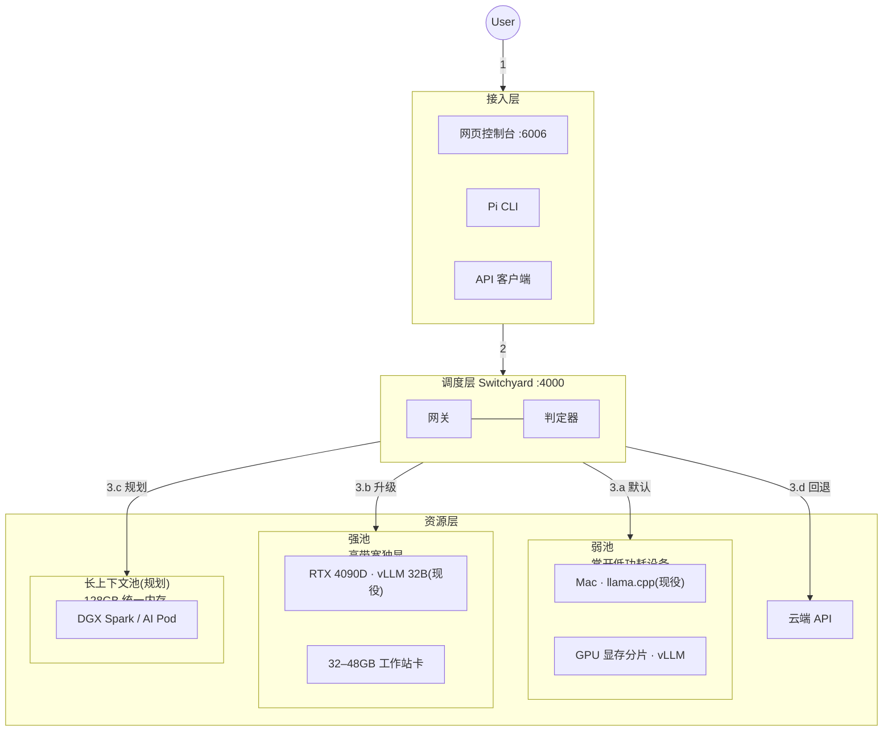

# AI 集群系统设计文档

本文档两部分：第一部分描述系统结构与设计决策，第二部分是对外接口契约。
各层的实现规范、配置与运维见 docs/tech.md。接口变更先改契约，再改实现。

# 第一部分 · 系统设计

## 1. 概述

本系统是一个跨设备的 LLM 推理集群。一个网关进程将 OpenAI 兼容的请求按成本
策略分发到多台机器上的推理引擎；云端 API 是最后的回退。目标部署形态：企业
内网若干台异构设备（消费级 GPU 机、Mac、大内存主机）各自执行一次安装后组成
集群，全公司使用同一个内网入口。

组成系统的四个部分：

| 部分 | 实现 | 自研量 |
|---|---|---|
| 接入层 | 网页控制台（FastAPI）、Pi CLI、任意 OpenAI/Anthropic 客户端 | 控制台约 300 行 |
| 调度层 | NVIDIA NeMo Switchyard，配置驱动 | 零改动 |
| 资源层 | 每节点一个推理引擎进程（vLLM / llama.cpp）+ 云端 API | 零改动，参数即配置 |
| 控制平面 | 健康探测、路由表编译、进程生命周期 | 约 400 行 shell |

### 术语

| 术语 | 定义 |
|---|---|
| 节点 | 一台运行推理引擎的物理设备。对外只暴露 OpenAI 格式 HTTP 与 `/health` |
| 池 | 一组可互换的节点。当前三个池：弱池（小模型，承接默认流量）、强池（大模型）、云端 |
| Hub | 运行网关、控制台与控制平面的那台设备 |
| 路由表 | 网关的全部配置。由控制平面按当前健康的节点集合生成 |
| 判定器 | 复用弱池模型的分类调用，判断会话是否需要升级到强池 |
| 会话粘性 | 被升级的会话此后固定走强池，不再回落 |
| 降级 | 某池失效后，路由表将其流量改指云端或幸存池 |

## 2. 请求生命周期



1. **接收**。用户从三个入口之一发起：网页聊天、Pi 终端、程序直调 API。
2. **归一化**。接入层将输入包装为 OpenAI 格式（`model: "auto"` + `messages`）。
   Anthropic 格式的客户端由网关在入站时翻译，后续路径相同。
3. **路由**。网关按优先级决策，转发时把 `model` 改写为目标节点的真实模型名：
   - 显式指定（`small`/`large`/`cloud`）直通对应池；
   - 会话已被升级过，走强池（粘性）；
   - 其余交判定器。判定依据是对话轨迹而非单条消息难度；连续两次给出
     升级结论才生效，升级后单向。
4. **执行**。目标节点的引擎解码，返回带 `usage` 的响应。
5. **返回**。响应原路返回。`model` 字段标注实际执行者，`auto` 不会出现在响应中。

网关不探测节点健康、不管理进程、不持久化任何请求内容。它的全部行为由
路由表文件定义。

## 3. 硬件与池的映射

分配依据是硬件的两个属性：内存带宽决定它适合稠密模型还是 MoE，
常开性决定它适合承接高频流量还是按需启动。

| 池 | 硬件要求 | 现役 | 候选 |
|---|---|---|---|
| 弱池 | 常开、低功耗；算力要求低 | Mac（llama.cpp，CPU） | 24GB 卡上的显存分片、懒猫 AI Pod |
| 强池 | 高内存带宽（稠密 32B 每 token 读全部权重） | RTX 4090D 24GB（vLLM） | 32–48GB 工作站卡；同型节点加入同池即负载均衡 |
| 长上下文池（规划） | 128GB 级统一内存（300B MoE 吃容量不吃带宽） | — | DGX Spark（单台或 2–4 台组网）、懒猫 AI Pod 128GB；Perplexity Portable Computer 是此形态的商业成品 |
| 云端 | — | 未配 key | Together、Anthropic、OpenAI |

节点间通信只有 HTTP，单请求流量为 KB 级，普通千兆局域网满足要求。
跨节点张量并行（把一个模型切到多台机器）不进入本设计：需要该能力的
硬件组合（如多台 DGX Spark 的 RoCE 组网）作为一个整体节点接入，
组网复杂度封装在节点内部。

## 4. 并发模型

| 组件 | 机制 | 实测上限 | 饱和行为 |
|---|---|---|---|
| 接入层 | 单进程异步 I/O | 数百连接，远超需求 | 不适用 |
| 网关 | 无状态异步代理 | 非瓶颈；`--workers N` 可多进程 | 不适用 |
| 判定器 | 每次裁决消耗一次弱池调用 | 弱池容量的 10–20% | 随弱池排队 |
| 弱池（vLLM） | 连续批处理 | 4 并发 108 tok/s（1.7B，200 token 级回答） | 排队，延迟上升 |
| 弱池（llama.cpp） | 单槽位 | 1 并发 14 tok/s（i9 CPU） | 串行排队。已知限制：`--parallel N` 可增加槽位，槽位切分上下文，未启用 |
| 强池（vLLM） | 连续批处理 | 1–2 并发满上下文 38 tok/s（32B@24GB） | 排队，延迟上升 |
| 云端 | 供应商侧 | 视配额 | 供应商限流 |

GPU 推理的并发不来自多线程：引擎将所有在途请求合并为一个动态批次，
上限由 KV cache 池和 `--max-num-seqs` 决定。网关多进程部署时，会话粘性表
随进程分片，需负载均衡按会话哈希；单进程部署无此问题。

系统在任何位置都不做过载拒绝。请求只会变慢，不会得到 429。这是当前版本
的已知限制，不是设计选择；配额与背压在路线图中。

## 5. 故障处理

控制平面在 Hub 上以 10 秒周期探测各节点 `/health`。节点连续两次失败即判死：
按幸存节点重新生成路由表，重启网关（秒级），失效池的流量改指云端
（已配 key）或幸存池。节点恢复后对称还原。控制平面不在数据路径上，
其自身失效不影响在途请求，只是失去自动降级能力。状态枚举与监控判据见
第二部分 §3.4，实现见第三部分 §4。

## 6. 非目标

- 不做跨节点张量并行（见 §3）。
- 不做请求级鉴权与计费。内网部署；对外暴露时在网关前加反向代理。
- 不持久化对话与上传文件。上传内容仅注入当次请求。
- 不在网关内执行工具。工具调用由客户端（如 Pi）执行，网关只透传 `tool_calls`。

# 第二部分 · 接口规格（API 文档）

> 集群对外的全部接口。约定：Hub 地址记作 `HUB`（单机部署即 `http://127.0.0.1`）。
> 数据面统一 OpenAI 线格式；内网部署默认无鉴权（企业部署加反代鉴权，见第三部分 §6）。

## 0. 端口总览

| 端口 | 服务 | 面向谁 |
|---|---|---|
| `HUB:4000` | 网关（主 API） | 所有客户端 |
| `HUB:6006` | 控制台（网页 + 其配套 API） | 浏览器用户 |
| 节点 `:8001` / `:8002` | 推理引擎（内部接口） | 仅网关调用，客户端不应直连 |

---

## 1. 主 API — 对话

### 1.1 `POST HUB:4000/v1/chat/completions`

发起一次对话/任务。OpenAI 线格式。

**请求字段**：

| 字段 | 类型 | 必填 | 说明 |
|---|---|---|---|
| `model` | string | 是 | **策略选择字**，枚举：`auto`（默认路径，系统自判）/ `small` / `large` / `cloud`（三个旁路，直通指定池） |
| `messages` | array | 是 | 对话内容。每项 `{role, content}`；`role ∈ {system, user, assistant}`；多轮对话按时间顺序排列 |
| `max_tokens` | int | 否 | 回答长度上限（建议填，默认值由引擎决定） |
| `temperature` | float | 否 | 随机度 0~2 |
| `stream` | bool | 否 | `true` 则以 SSE 流式返回（见 1.3） |
| `chat_template_kwargs` | object | 否 | 引擎扩展；本集群约定 `{"enable_thinking": false}` 关闭 Qwen3 思考模式（默认已关，显式开启才需要传） |
| `tools` | array | 否 | 工具声明（OpenAI function 格式）；agent 类客户端使用 |

**请求示例**：

```json
{
  "model": "auto",
  "messages": [
    { "role": "system", "content": "你是公司内部助手" },
    { "role": "user",   "content": "分析这份合同的违约风险" }
  ],
  "max_tokens": 1024
}
```

**响应（200）**：

```json
{
  "model": "qwen3-32b-awq",
  "choices": [ {
    "index": 0,
    "message": { "role": "assistant", "content": "主要风险有三处…" },
    "finish_reason": "stop"
  } ],
  "usage": { "prompt_tokens": 35, "completion_tokens": 210, "total_tokens": 245 }
}
```

响应中的 `model` 为实际执行者，`auto` 不出现在响应中；计量与审计以此字段为准。
`finish_reason ∈ {stop, length, tool_calls}`。

**错误**：

| 状态码 | 场景 | 响应体示例 |
|---|---|---|
| 404 | `model` 不在枚举内 | `{"error": {"message": "unknown model ..."}}` |
| 500 | 下游节点失联（路由表未及时降级的窗口内） | `{"message": "SwitchyardUpstreamError('upstream failed: ...')", "type": "internal_error", "code": "internal_chain_error"}` |
| 400 | 请求体格式非法（缺 messages 等） | 引擎/网关的校验信息原样透传 |

### 1.2 `POST HUB:4000/v1/messages`（Anthropic 方言入口）

同一个网关同时接受 Anthropic Messages 格式（供 Claude 系客户端零改动接入），
入站即翻译，语义与 1.1 完全等价。字段差异见第三部分 §3。

```json
{ "model": "auto", "max_tokens": 1024, "system": "你是公司内部助手",
  "messages": [ { "role": "user", "content": "分析这份合同的违约风险" } ] }
```

### 1.3 流式返回（`stream: true`）

SSE 流，每行一个 `data: {chunk}`，以 `data: [DONE]` 结束：

```
data: {"choices":[{"delta":{"role":"assistant"}}], "model":"qwen3-1.7b-gguf"}
data: {"choices":[{"delta":{"content":"主要"}}]}
data: {"choices":[{"delta":{"content":"风险…"}}]}
data: [DONE]
```

需要流式时也统计用量的，传 `"stream_options": {"include_usage": true}`。

---

## 2. 主 API — 目录与统计（只读）

### 2.1 `GET HUB:4000/v1/models`

列出可用的策略名与直连模型名：

```json
{ "object": "list", "data": [
  { "id": "auto" }, { "id": "small" }, { "id": "large" }, { "id": "cloud" },
  { "id": "qwen3-32b-awq" }, { "id": "qwen3-1.7b-gguf" } ] }
```

### 2.2 `GET HUB:4000/v1/routing/stats`

路由器累计账目（进程内统计，重启清零）：

```json
{ "total_requests": 9, "total_errors": 0,
  "total_tokens": { "prompt": 3200, "completion": 2674, "total": 5874 },
  "cost_estimate": { "total_cost": 0.0 },
  "classifier": { "total_requests": 4, "total_errors": 0 } }
```

`total_errors` 持续增长表示存在不可用的下游节点。`classifier.*` 为判定器自身的调用计数。

---

## 3. 控制台配套 API（`HUB:6006`）

### 3.1 `GET /` — 聊天页面（HTML）

### 3.2 `POST /api/chat`

网页专用的对话代理：请求体与 1.1 完全相同；响应在 1.1 基础上附加端到端延迟：

```json
{ ...同 1.1 响应..., "_console": { "latency_ms": 3216 } }
```

### 3.3 `POST /api/upload`（multipart/form-data，字段名 `file`）

上传文本类文件供对话引用。限制：≤2MB；仅文本（txt/md/csv/json/代码）。

```json
// 200
{ "name": "report.txt", "chars": 60, "truncated": false, "text": "第一季度营收…" }
// 400
{ "error": "File too large (2MB limit)" }
{ "error": "Only text files are supported for now ..." }
```

超过 12000 字符的内容截断返回并置 `truncated: true`。

### 3.4 `GET /api/status`

集群状态快照（页面每 5 秒轮询它）：

```json
{
  "mode": "normal",
  "lanes": { "large": true, "small": true },
  "devices": [
    { "name": "Hub — this Mac",
      "hw": "Intel Core i9-9880H · 16GB RAM · CPU inference", "ok": true,
      "items": [ {"label": "Router · Switchyard :4000", "ok": true},
                 {"label": "qwen3-1.7b-gguf · llama.cpp (CPU)", "ok": true} ],
      "last": { "latency_ms": 905, "completion_tokens": 13, "tok_s": 14.4, "at": "23:36:31" } },
    { "name": "GPU node — via SSH tunnel",
      "hw": "NVIDIA GeForce RTX 4090 D · 24564 MiB", "ok": true,
      "items": [ {"label": "qwen3-32b-awq · vLLM", "ok": true} ],
      "last": { "latency_ms": 1148, "completion_tokens": 11, "tok_s": 9.6, "at": "23:36:32" } }
  ],
  "stats": { "requests": 5, "tokens": 2187, "errors": 0 },
  "escalations": [ { "time": "2026-09-06 05:01:41",
                     "detail": "(turn 5): the task is outside the scope of the efficient tier ..." } ]
}
```

`mode` 枚举：`normal | degraded-large-small | degraded-large-cloud |
degraded-small-large | degraded-small-cloud | degraded-all-cloud | dead`。
`≠ normal` 即为告警条件。

---

## 4. 节点内部接口（客户端勿直连，列出仅为完整性）

| 接口 | 说明 |
|---|---|
| `POST 节点:800x/v1/chat/completions` | 与 1.1 同格式，但 `model` 必须是该节点声明的真实模型名 |
| `GET 节点:800x/health` | 200 = 存活。网关健康探测与看门狗的依据 |


---

# 第三部分（已迁移）

技术溯源内容已迁移至 docs/tech.md（按层组织：接入/调度/资源/硬件/控制平面/
并发/运维），本文档保留系统设计（第一部分）与接口契约（第二部分）。
